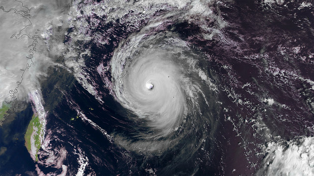
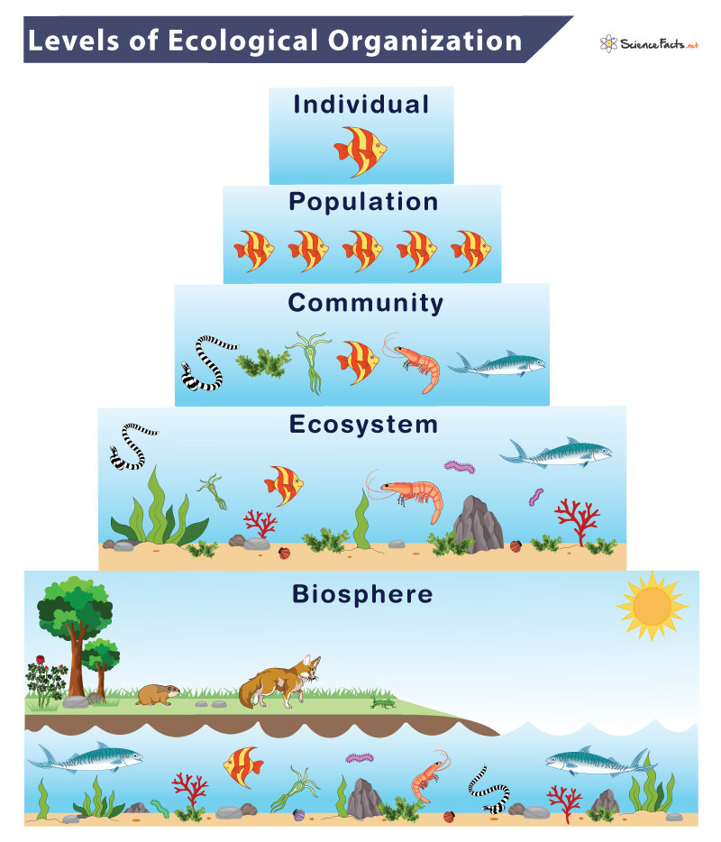
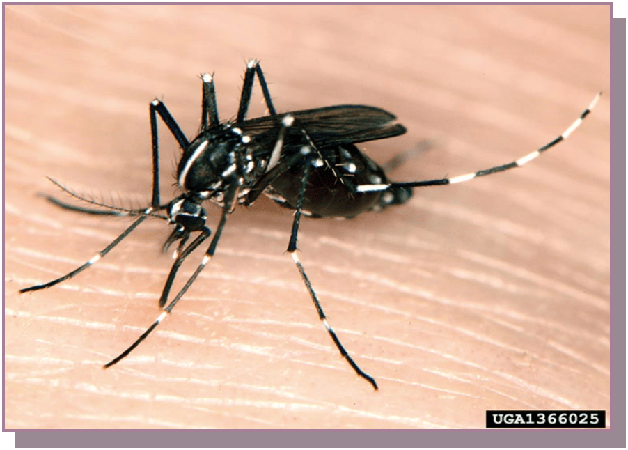
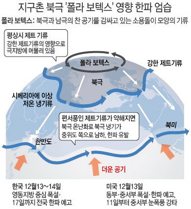
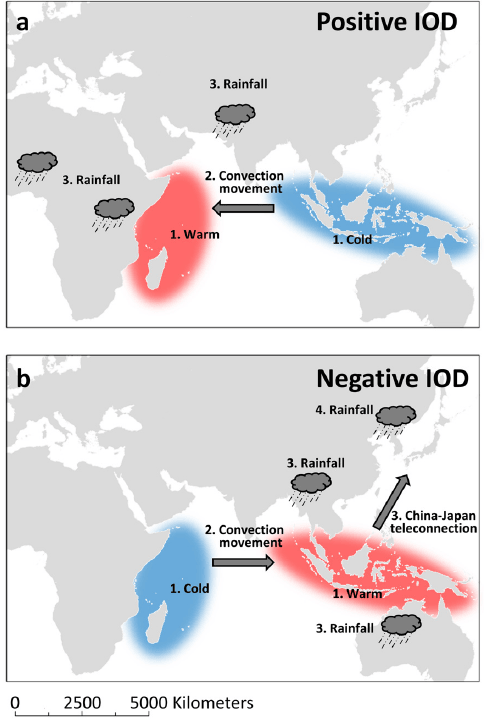
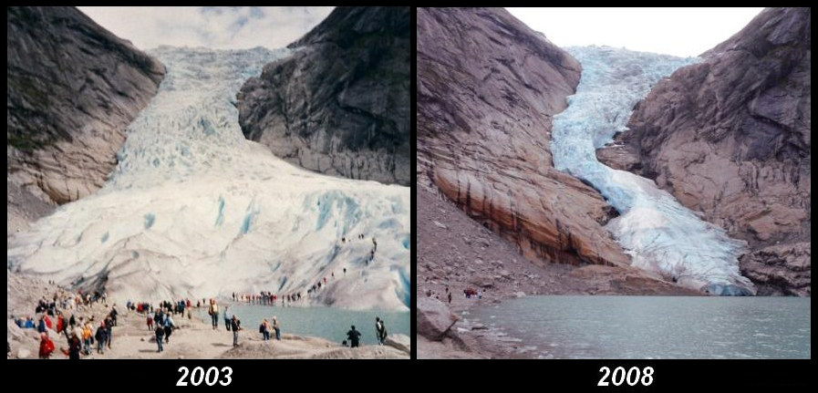
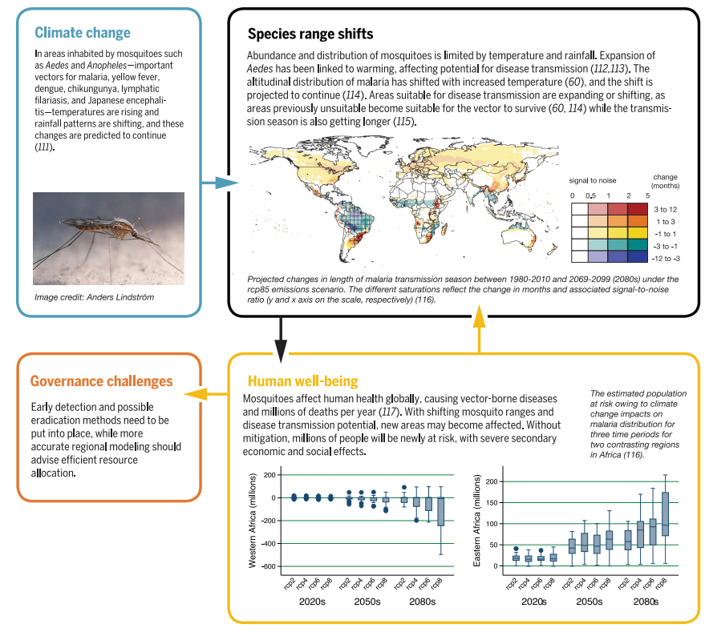

# 환경과 감염병: 변하는 세계에 적응한다는 것

## 0. 도입: 왜 감염미생물학 강의에서 '환경'을 알아야 하나?

한 학기에 걸쳐 우리는 세균·바이러스·진균·기생충의 구조와 유전(교과서 1부)에서 시작해 병원체 각론(2부), 기관계·경로별 감염병(3부), 면역·소독·진단(4부)에 이르기까지, 병원체와 감염 현상, 그리고 그 관리와 치료를 깊이 있게 공부했다. 그런데 감염성 질병을 공부할 때 특히 경계해야 할 점이 하나 있다. 바로 교과서에 실린 정보를 정적(static)인 것으로 받아들이는 태도다. 우리가 살아가는 실세계(real-world)는 교과서에 적힌 그대로 멈춰 있지 않고, 주변 환경이 시시각각 변하기 때문이다.

그래서 이제부터 우리는 보다 동적인(dynamic) 관점에서 감염병을 들여다본다. 특히 새로운 감염병의 출현이나 기존 감염병의 확산처럼 책과 다른 현상이 나타나는 이유를 이해하는 것이 목표다. 감염병은 병원체에 감염되어 생기고, 병원체와 접촉하는 순간이 곧 발병의 출발점이므로, 접촉 확률을 낮추는 것이 최선의 예방이다. 하지만 우리가 아무리 조심해도 환경 자체가 변하는 것까지 막을 수는 없다. 그러므로 환경 변화에 따라 감염병의 양상이 어떻게 달라지는지 이해해 두면, 우리의 직무를 수행하는 데 큰 도움이 될 것이다.

{#fig-c1-ch1-fig1-typhoon-haiyan}

(출처: https://www.smosstorm.org).

이 챕터에서는 환경이 어떻게 변하며 감염병의 동태에 영향을 미치는지 살펴본다. 다양한 환경 변화 현상 중에서 그 효과가 광범위하고 불가피한 변화 상황인 "기후 변화(climate change)"의 영향에 대해서 공부할 것이다. 그리고 이어지는 챕터에서는 그 무대 위에서 병이 생기는 일을 확률로 읽는 법을, 마지막 챕터에서는 그 확률을 분포로 그려 미래를 내다보는 법을 배운다. 오늘의 '이해'가 다음 두 주의 '예측'과 '대비'로 이어지는 셈이다.

::: {.callout-note title="이 강의를 왜 간호사가 배우는가"}
여러분은 교과서에 실리지 않은 환자를 반드시 만나게 된다. 환경이 발병의 지도를 바꾸고 있기 때문이다. "배운 적 없어 모르겠다"가 통하지 않는 이유, 그리고 꾸준한 공부가 필요한 이유가 오늘 강의 안에 있다.
:::

---

## **1. 환경을 본다는 것**

환경을 이야기할 때 나는 늘 **다양성(diversity)**을 강조한다. 다만 다양성을 이야기하려면, 먼저 "무엇이 모여 있는가"를 알아야 한다.

1학기 "인체구조와기능"에서 우리는 세포 → 조직 → 기관 → 기관계 → 개체로 올라가는 **위계(hierarchy)**를 배웠다. 여기까지는 한 사람, 한 마리 — 즉 **개체(individual)** 안의 이야기다. 생태학·환경과학은 개체에서 한 단계 위로 올라간 세계를 다룬다. 개체가 모이면 같은 종의 **개체군(population)** 이, 여러 종의 개체군이 모이면 **군집(community)** 이 되고, 여기에 물·토양·기후 같은 무생물 환경이 결합해 규모가 커지면 **생태계(ecosystem)** 가 된다. 비슷한 생태계를 주로 식물을 기준으로 묶으면 **생물군계(biome)** 가 되고(예컨대 온대낙엽수림대는 한국·중국·일본을 포함한다), 이 모두를 합치면 지구 전체의 **생물권(biosphere)** 이 된다.

{#fig-c1-ch1-fig2-levels-of-ecological-organization}

여기서 중요한 개념이 하나 나온다. 개체 하나만 볼 때는 없다가 여럿이 모였을 때 비로소 나타나는 성질 — 이것을 **창발성(emergent property)** 이라 한다. 물 분자 하나에는 '축축함'이 없지만 물이 모이면 축축함이 생기는 것과 같고, 한 사람만 따로 관찰해서는 그 성격을 잘 알기 어렵지만 여러 사람 사이에 놓고 보면 비로소 그 사람의 사회적 성격이 드러나는 것과 같은 이치다.

집단 수준에서 발견할 수 있는 대표적인 창발성이 바로 **다양성(diversity)** 과 **상호작용(interaction)** 이다. 학생 여러분 모두 사람(_Homo sapiens sapiens_)이면서 서로 다르게 생긴 것도 다양성의 일종이다(전문적으로는 표현형 다양성 phenotype diversity이라고 부른다). 병원미생물학 주제에 맞춰 예를 들면, 어느 서식처에 대장균(_Escherichia coli_)이 존재하는데 그 대장균의 혈청형을 조사했더니 10가지가 넘는다면, 대장균 혈청형이 다양하게 존재한다고 말할 수 있다. 또 다른 창발적 성질인 상호작용은 말 그대로 둘 이상의 개체, 혹은 두 종 이상의 존재가 서로 영향을 주고받는 것을 뜻한다. 강의실 안에서 총대와 학생들 간에 일어나는 상호작용, 한여름 숲 속을 걷다가 모기에게 물리는 것도 모두 상호작용이다(예: _H. sapiens_ vs. _Aedes albopictus_).

::: {.callout-note title="**_Aedes_ 속명에 대하여**"}
_Aedes albopictus_는 동의어로 _Stegomyia albopictus_라고도 불리며, 둘은 같은 종이다. 과거 학계에서 아속(subgenus)인 _Stegomyia_를 속(genus) 수준으로 격상하려는 움직임이 있어 지금도 둘을 같은 의미로 쓰지만, 오랜 기간 _Aedes_를 써 왔기 때문에 혼란을 피하려고 _Aedes_라는 속명을 더 많이 쓰는 경향이 있다.
:::

개체군 이상의 집단이 형성되면 이런 창발성이 관측되는데, 문제는 창발적 성질이 공간에 따라 다르게 나타나고 시간에 따라 변한다는 점이다. 모기를 다시 예로 들어 보자. 여름에 숲 속에서 만나는 검은색 모기들 가운데, 다리에 흰색 줄무늬 밴드가 3개씩 있고 흉부 등쪽(dorsal thorax)에 종방향(longitudinal) 흰 줄이 하나 뚜렷하게 새겨진 모기가 흰줄숲모기(_A. albopictus_)다. 이 모기는 여름철에 낮밤을 가리지 않고, 사람이 근처에 있으면 물기 위해 달려드는 경향이 있다. 한국 안에서도 위도(latitude)와 고도(elevation)에 따라 온도 차이가 나기 때문에, 똑같은 6월 중순이라도 남부 지역에서는 _A. albopictus_ 를 좀 더 쉽게 만날 수 있고, 중부 지역에서는 상대적으로 선선해 이 종이 덜 나타난다. 같은 시기에 서로 다른 위치의 산에 100명씩 등산을 갔는데 남부 지역 산에서는 72명이, 중부 지역에서는 23명이 모기에 물렸다면, 이는 상호작용이 시공간에 따라 다르게 나타나는 경우라 할 수 있다.

{#fig-c1-ch1-fig3-aedes-albopictus}

여기서 질문. 남부 지역에서는 항상 6월 중순에 산에 가면 약 70% 정도의 사람만 모기에 물릴까? 같은 사람들로 30년을 계속 같은 시기에 같은 경로로 등산하면 매년 70% 정도의 수치가 변하지 않을까? 여러 가지 이유 때문에 그렇지 않을 가능성이 매우 높다. 그런 여러 이유 중에서 환경이 변해서 생물간 상호작용이 달라지는 일은 어렵지 않게 만날 수 있다. 그리고 이런 일이 비일비재하므로 여러분과 같은 보건 전공 전문가들은 시시각각 촉각을 곤두세우고 있다. 창발적 성질을 역동적으로 변하게 만드는 기후 변화는, 기후·환경·생태 전공자가 아니더라도 반드시 이해하고 있어야 할 중요한 문제다.

::: {.callout-note title="**환경과학 vs. 생태학 — 시선의 차이**"}
거칠게 나누면, 환경과학은 사람을 중심에 두고 나머지를 관리하려는 시선이고, 생태학은 사람도 여러 구성원 중 하나로 보고 멀리서 관찰하는 시선이다. 감염병을 다룰 때는 두 시선이 모두 필요하다.
:::

---

## 2. 감염과 환경 변화: 감염 삼각형·병원소·One Health 복기

이제 우리는 새로 외울 것을 꺼내는 게 아니라, **이미 배운 것을 다른 각도에서 다시 보는** 시간을 갖는다.

교과서 2장(감염병의 발생기전과 전파)에서 우리는 감염병 성립을 **병원체 · 숙주 · 환경**의 평형으로 배웠다(그림 2-1, 표 2-3). 그리고 우리는 그 평형을 흔드는 요인 중 하나로 **"물리적 상황 및 사회적 환경 — 기후·날씨·지리"** 라는 것을 이미 파악하였다. 이 챕터에서 우리는 이미 공부한 컨셉을 좀 더 펼쳐서 이해하는데 초점을 맞춘다. 감염 삼각형의 세 꼭짓점 가운데 그동안 가장 적게 들여다본 **'환경' 꼭짓점**을, 이제 환경 변화라는 측면에서 넓혀 본다.

같은 2장에서 배운 **병원소(reservoir)** 개념도 다시 꺼내자. 병원체가 사람 밖 — 동물·흙·물 — 에 살아남아 머무는 자리를 말한다. "병이 어디에 숨어 기다리는가"라는 이 개념은, 이 챕터의 6절에서 "사라졌던 병이 왜 다시 오는가"의 답이 된다. 나아가 12장(동물·절지동물매개 감염병)은 **인수공통감염병(zoonoses)** — 동물과 사람을 오가는 병 — 을 다루며, 전체 감염병의 60% 이상이 인수공통이고 신종 감염병의 75% 이상이 야생동물에서 유래한다고 했다. 이 숫자는 교과서만의 주장이 아니라 국제 문헌과도 일치한다. Taylor 등(2001)은 사람을 감염시키는 병원체 1,415종 중 61%가 인수공통임을 보고했고, Jones 등(2008)은 신종 감염병 사건의 60.3%가 인수공통이며 그중 71.8%가 야생동물에서 왔다고 분석했다(Taylor et al., 2001; Jones et al., 2008).

이 사실들은 공통으로 **병이 동물·환경에 뿌리를 두고 있다면, 동물과 환경이 변할 때 발병 양상도 변할 수밖에 없다**는 것이다. 이 모든 연결을 한 단어로 묶은 것이 **One Health**다. 세계보건기구는 이를 "사람·동물·식물·생태계의 건강을 함께 최적화하려는 통합적 접근"으로 정의한다(World Health Organization, 2023). 사람의 건강은 바다·숲·가축·기후의 건강과 한 몸이라는 뜻이며, 이것이 오늘 강의 내내 흐르는 큰 그림이다.

::: {.callout-note title="핵심 주제"}
환경이 병을 바꾸는 방식을 서로 다른 두 경로로 따라가 보자.
- **주제 ① 육상 매개(vector)** — 모기·진드기가 옮기는 병 〔12장〕. 살아 있는 운반자가 노출을 만든다.
- **주제 ② 해양 매질(medium)** — 비브리오패혈증. 운반자 없이 **'바닷물이라는 환경 그 자체'** 가 노출을 만든다.
두 주제는 뒤에서 계속 나란히 등장한다.
:::

---

## 3. 기후란 무엇인가

'기후변화'를 이야기하려면 **기후**와 **날씨**부터 정확히 구분할 수 있어야 한다. **날씨(weather)** 는 지금·오늘·이번 주의 대기 상태, 맑았다 흐렸다 하는 짧은 변덕이다. 반면 **기후(climate)** 는 어떤 지역 날씨의 **오랜 평균 상태**다. 세계기상기구(WMO)는 기후를 표현하는 표준으로 **연속된 30년의 평균값(기후평년값)** 을 쓰며, 현재 표준 기간은 1991–2020년이다.

따라서 **기후변화**란 일주일 사이의 변덕이 아니라, **맑은 날·비 오는 날의 '빈도'와 '분포'가 통째로 이동하는 현상**이다. "요즘 여름이 옛날보다 확실히 덥다"는 체감 — 그것이 30년 평균이 옮겨가고 있다는 뜻이다.

우리에게 가장 피부에 와닿는 예가 **장마**다. 장마는 예년 6월 하순부터 7월 중하순까지, 북쪽의 찬 기단과 남쪽의 덥고 습한 기단이 부딪쳐 **정체전선**을 이루고 많은 비를 뿌리는 현상으로, 보통 제주에서 시작해 북상한다. 그런데 최근 몇 년은 여름철 강한 고기압이 자리 잡으면서 장마전선이 제대로 서지 못하고 제주보다 더 남쪽에서 비를 뿌리는 일이 잦아졌다. 부산에서 여름을 나 보면, 장마 기간인데도 비 오는 날이 손에 꼽는 해가 있다. **이 '평균의 이동'이 곧 기후변화다.**

여기서 '기후변화'와 '극한기후'가 어떻게 이어지는지 짚어 두자. 기후변화가 단지 평균값 하나가 오른쪽으로 옮겨가는 일이라면 그리 무섭지 않을지도 모른다. 문제는 평균이 움직일 때 **날씨의 분포 전체가 통째로 옮겨간다**는 데 있다. 어떤 지역의 여름 기온을 수십 년 동안 모아 그리면 가운데가 불룩한 종 모양이 되는데, 대부분의 날은 가운데(평범한 날)에 몰리고 기록적 폭염 같은 극단은 분포의 양 끝 꼬리에 아주 드물게 걸린다. 그런데 평균이 조금만 오른쪽으로 밀려도, 예전엔 꼬리 끝에 있어 좀처럼 나타나지 않던 극단이 **훨씬 자주** 걸리게 된다. 여기에 분포 자체가 넓어지기(변동성이 커지기)까지 하면 극단은 더욱 잦아진다. 이렇게 **과거엔 어쩌다 한 번이던 극단적 날씨가 예사로 나타나게 된 상태**, 그것이 바로 **극한기후(climate extremes)**다.

이건 말장난이 아니라 관측으로 확인된다. Hansen 등(2012)은 여름철에 평년(1951–1980) 대비 표준편차의 3배를 넘는 극심한 폭염이 나타난 육지 면적이 과거에는 채 1%도 되지 않았는데 최근에는 약 10%로 넓어졌다고 보고했다 — 예전 같으면 아주 드물던 폭염이 이제는 해마다 지구 곳곳에서 벌어진다는 뜻이다. 이들은 이를 두고 "기후 주사위가 무거워졌다(loaded dice)"고 표현했다(Hansen et al., 2012). IPCC 제6차 평가보고서도 1950년대 이후 폭염을 비롯한 극한 현상이 더 잦고 더 강해졌다고 정리한다(IPCC, 2021).

비유하자면, 기후변화는 우리를 **살얼음판 위**로 올려놓았다. 평균이 오른 만큼 얼음이 얇아졌고, 대홍수·극심한 가뭄·기록적 폭염이 **언제 발밑을 깨고 들어와도 이상하지 않은** 상태가 된 것이다. 감염병도 마찬가지다. 뒤(5절)에서 보겠지만 극한기후 한 번은 인간 사회를 무너뜨리고 그 복구 과정에서 감염병을 부른다 — 문제는 그 '한 번'이 이제 예외가 아니라 **언제 닥쳐도 이상하지 않은 일상적 위험**이 되었다는 데 있다. 드물던 것이 흔해지는 이 셈법을 확률과 분포의 언어로 정확히 읽는 법이 바로 13주차(확률)와 14주차(분포)의 주제다.

---

## 4. 지구는 이미 변하고 있다 — 변화의 증거들

기후변화를 '앞으로 닥칠 재난'으로만 말하면 막연하다. 관점을 바꿔, **"환경이 이미 변했다는 것을 우리가 어떻게 아는가"**, 그 증거를 보자. 증거는 성격이 둘로 나뉜다 — **서서히 드러나는 변화**와 **점점 격해지는 극한**이다. 이 구분이 뒤 5·6절의 뼈대가 된다.

### (가) 서서히 드러나는 변화

먼저, **가장 더운 해가 계속 갱신되고** 있다. 흔히 "올여름이 앞으로 남은 평생에서 가장 시원한 여름"이라는 말이 회자되는데, 이 말을 특정 인물의 발언으로 못 박기는 어렵지만 그 밑에 깔린 사실은 분명하다. 유럽 코페르니쿠스 기후변화서비스에 따르면 2024년은 관측 사상 가장 더운 해였고, 산업화 이전 대비 **1.5℃를 처음으로 넘어선 해**였다(Copernicus Climate Change Service, 2025). 미국 항공우주국(NASA GISS)도 같은 결론을 독립적으로 확인했다.

이 온난화는 **얼음과 바다에 흔적**을 남긴다. IPCC 제6차 평가보고서는 지구 평균기온이 산업화 이전보다 약 0.99℃ 오르고 해수면이 1901–2018년 사이 약 0.20 m 상승했으며(IPCC, 2021), 북극 해빙이 1979년 이후 뚜렷이 줄고 전 세계 빙하가 1993–2019년에 약 6,200 Gt(다 녹으면 해수면 약 17 mm이 상승하는 양에 해당)나 사라졌다고 정리한다(Fox-Kemper et al., 2021). 그리고 이 상승은 **사람의 삶터를 직접 위협한다.** 남태평양의 낮은 산호섬 나라들(투발루·키리바시·마셜제도)은 해수면 상승으로 침수 위험이 커져, 고배출 시나리오에서는 금세기 후반 섬 전체가 해마다 파도에 잠기는 상황이 예상되고, 이미 이주·이동이 논의되고 있다(Mycoo et al., 2022). 앞서 1절에서 예고한 "생물의 분포 이동"도 같은 변화이다. Parmesan과 Yohe(2003)는 1,700종이 넘는 생물이 10년마다 평균 약 6.1 km씩 극지방·고지대로 이동하고 봄철 생물 현상이 앞당겨진다는, **전지구적으로 일관된 기후변화의 영향**을 찾아냈다(Parmesan & Yohe, 2003).

### (나) 점점 격해지는 극한

변화가 서서히 쌓이는 동안, **극한은 점점 격해진다.** 2019–2020년 호주의 "블랙 서머" 산불처럼 대형 산불이 잦아지는데, 귀속(attribution) 연구는 인위적 온난화가 그 배경의 폭염을 최소 두 배 더 잦게 만들고 화재기상지수를 30% 이상 높였다고 평가했다(van Oldenborgh et al., 2021). 캘리포니아의 초대형 산불도 같은 맥락이다.

역설적이게도, **더워지는 지구의 어떤 곳에는 혹독한 추위**를 보낸다. 북극이 중위도보다 몇 배 빠르게 데워지면(북극 증폭) 제트기류가 느슨해져 남북으로 크게 구불거리고, 그 골을 타고 북극의 찬 공기가 중위도까지 쏟아져 내려온다는 가설이 있다(Cohen et al., 2014). 우리나라 겨울에 이따금 찾아오는 강한 한파도 이 틀로 설명되곤 한다.

::: {.callout-note title="북극 한파 논쟁"}
**이 연결은 아직 논쟁 중이다.** 관측 연구는 대체로 이 관련성을 지지하지만 기후모형 연구는 뚜렷한 연결을 잘 보이지 않아, 학계의 합의가 필요한 상황이다(Cohen et al., 2020). 뉴스에서 간간히 이런 소식이 겨울에 보도되는데 개연성 있는 주장이지만 과학적으로는 좀 더 연구가 필요한 사실임을 기억하자.
:::

{#fig-c1-ch1-fig4-arctic-oscillation}

극한은 **한쪽엔 가뭄, 다른 쪽엔 홍수**라는 얼굴로도 나타나고, 그 배후에는 종종 **엘니뇨 같은 원격 기후신호**가 있다. 원격 기후신호란 저 멀리 바다의 수온 변화가 대기를 타고 먼 지역의 강수를 바꾸는 현상이다. 예컨대 엘니뇨/남방진동에 연동된 해수온·식생 변화로 아프리카 리프트밸리열의 대발생을 몇 주 앞서 예측할 수 있었다는 연구가 있다(Anyamba et al., 2009). 비슷한 사례로 인도양 쌍극자(IOD)라는 신호가 장마를 약화시켜 여름 가뭄을 부르고, 그 결과 낙동강에서 남조류가 대번성하는 "기후–국지기상–수문–생태계"의 연쇄 현상도 보고된 바 있다(Jeong & Joo, 2016). 요점은, **먼 곳의 신호 하나가 우리 국지 환경을 통째로 흔들 수 있다**는 것이다.

{#fig-c1-ch1-fig5-iod-vs-kmr}

### (다) 얼음이 풀어놓는 것에 대한 우려

끝으로, 조금 섬뜩하지만 짚어야 할 이야기가 있다. **녹는 영구동토가 오래 잠들어 있던 미생물을 풀어놓을 수 있다**는 것이다. 이건 실제 상황이다. 연구진은 시베리아 영구동토에서 약 3만 년 전의 거대 바이러스(_Pithovirus sibericum_)를 되살려, 수만 년 얼어 있어도 감염력이 유지될 수 있음을 보였다(Legendre et al., 2014). 2016년 시베리아 야말에서는 이례적 폭염이 영구동토를 녹여 오래 묻혀 있던 감염된 순록 사체를 드러냈고, 약 70년 만에 탄저가 재발한 것으로 분석된다(Ezhova et al., 2021).

{#fig-c1-ch1-fig6-glacier-melting}

다만 우려하는 영향이 아직은 보고되지 않았다. 되살아난 그 고대 바이러스는 사람이 아니라 아메바만 감염시키며, 사람 건강을 위협한다는 증거는 없다. 최근 종합 평가도 영구동토가 무수한 미지의 미생물을 품고 있는 것은 사실이나, 사람에게 미치는 위험은 현재로선 대체로 작고 매우 불확실해 **경계는 필요하되 공포는 이르다**고 결론짓는다(Wu et al., 2022). 오늘 이 사례를 넣는 이유는 위협의 크기 때문이 아니라, **"고정돼 있다고 믿었던 것(얼음)조차 실은 변하고, 그 변화가 병원체와 우리의 접점을 바꾼다"** 는 원리를 보여 주기 때문이다.

다만, 우리는 이미 앞에서 미생물의 돌연변이에 대해 공부하였고, 미생물이 계대(subculture)를 거듭하고 감염 빈도를 늘일수록 돌연변이가 발생하여 유전적 다양성을 갖출 기회가 많아진다는 사실을 알고 있다. 영구 동토에서 튀어나온 정체 모를 고대의 미생물이 언제까지고 우리에게 영향을 미치지 않을 것이라는 낙관은 금물이다.

---

## 5. 기후가 바뀌면 병은 어떻게 바뀌나 — 공통점, 그리고 극한에 대한 적응

앞 절에서 기후변화에 대한 사례를 여럿 보았다. 이제 한 걸음 물러서서 묻는다. **이 사례들의 공통점은 무엇인가?** 기후변화가 감염병을 부르기 쉬운 이유를, 겉모습이 제각각인 사건들에서 공통 원리로 뽑아 보자.

**공통점 ① 극한기후가 '방어가 설계되지 않은' 거주구역을 때리고, 복구 과정에서 후속 피해가 잇따른다.** 인간의 거주 환경은 특정 범위의 날씨를 견디도록 설계돼 있다. 그 범위를 넘는 홍수·폭염·산불이 닥치면 상하수도·전력·주거가 무너지고, 그 뒤가 더 문제다. 이재민이 대피소에 밀집하고 깨끗한 물과 위생이 끊기면서, 재난 이후의 감염병은 대개 **이 복구 과정의 붕괴**에서 발생한다. 실제로 자연재해 후 유행은 병원체의 유입 자체보다 인구 이동과 안전한 물·위생의 상실에서 비롯되며, 홍수 뒤에는 오염된 물로 인한 수인성 질환이 가장 흔한 위험이다(Watson et al., 2007; Levy et al., 2016).

**공통점 ② 자원과 영양의 붕괴가 숙주 자신의 방어를 무너뜨린다.** 가뭄과 기근은 병원체를 직접 옮기지 않지만, **숙주를 약하게** 만든다. 영양결핍은 면역을 손상시켜 감염에 대한 감수성과 중증도, 사망률을 모두 끌어올리고, 감염은 다시 영양 상태를 악화시키는 **악순환**을 만든다(Katona & Katona-Apte, 2008). 2장에서 배운 성립 등식의 분모, 곧 '숙주의 저항성'이 통째로 낮아지는 셈이다.

**공통점 ③ 온도와 강수 자체가 병원체·매개체의 생태학을 바꾼다.** 이것이 앞서 박스로 설명한 두 핵심주제가 다시 등장하는 지점이다. 육상에서는, 기온이 오르면 모기 몸속에서 병원체가 자라는 **외부잠복기가 짧아지고** 흡혈이 잦아져, 모기 수가 그대로여도 한 마리의 전파력이 커진다(Rocklöv & Dubrow, 2020). 매개 전파능력은 기온에 따라 대략 23–29℃에서 최고가 되는 산 모양으로 변한다(Mordecai et al., 2019). 바다에서는, 해수온이 오를수록 비브리오(_Vibrio vulnificus_)가 더 잘 자라 더 북쪽까지, 더 긴 계절 동안 위험을 만든다(Baker-Austin et al., 2013). 우리나라도 연안 비브리오패혈증이 여름에 집중되며 **최고 해수온이 발생의 가장 강력한 예측 인자**였다(Kim & Chun, 2021). 이 병은 위험군에서 치명률이 매우 높아, 감염자 5명 중 약 1명이 사망한다(Centers for Disease Control and Prevention, 2024).

::: {.callout-tip title="그래서 방향은 한쪽이 아니다"}
위 세 공통점은 대체로 '악화' 쪽이다 — Mora 등(2022)은 알려진 사람 질병의 절반 이상이 기후 위해로 악화될 수 있다고 정리했다(Mora et al., 2022). 하지만 늘 그런 것은 아니다. 예컨대 비가 극단적으로 줄면 모기의 산란 웅덩이가 마르고 서식처가 좁아져, 그 지역에서는 오히려 매개 전파 기회가 줄기도 한다. **기후는 병을 양방향으로 밀며, 그래서 우리는 '더우니 무조건 창궐'이 아니라 지역·조건·시기별로 읽어야 한다.** 이 '읽는 법'이 다음 챕터에서 다룰 확률이다.
:::

이 세 공통점을 관통하는 더 큰 그림이 있다. **인간은 거주 환경의 안정성을 꾸준히 강화해 왔다** — 제방을 쌓고, 상하수도를 놓고, 냉난방을 들이고, 방역 체계를 세웠다. 문제는 환경이 그 안정성의 설계 범위를 벗어날 때 생기며, 이 벗어남은 두 가지 속도로 온다.

- **급성 충격(shock)** — 한순간의 극한기후. 설계 범위를 단번에 넘어선다.
- **만성 압력(press)** — 시나브로 진행되는 기후 변화. 눈치채기도 전에 조건을 밀어 올린다.

이 절의 사례들(홍수·가뭄·산불·한파)은 대부분 **급성 충격**이다. 그렇다면 우리는 무엇을 해야 할까? **극한기후에 대한 적응**이다. 구체적으로는, 설계 범위를 넘는 사건을 전제로 한 **회복탄력적 기반시설**, 재난을 앞서 알리는 **조기경보**, 그리고 무엇보다 **복구기의 감염 관리** — 안전한 식수·위생 확보, 대피소 밀집에서의 호흡기·수인성 감염 차단, 영양 지원 — 이다. 재난 간호가 곧 감염 예방이라는 사실이 여기서 나온다. 다음 절은 나머지 한 축, **만성 압력에 대한 적응**을 다룬다.

---

## 6. 질병 지도는 고정이 아니다 — 점진적 변화에 대한 적응

급성 충격이 눈에 확 띄는 재난이라면, 만성 압력은 **조용히 진행되어 더 위험**할 수 있다. 서서히 변하는 서식 환경에 우리가 적응하지 못할 때, 감염병의 지도는 소리 없이 다시 그려진다. 이 지도는 두 방향으로 움직인다 — 공간으로 번지고(분포 이동), 시간으로 되돌아온다(재출현·신종).

**공간축 — 경계가 북상한다.** 서로 다른 두 생태계가 만나는 경계를 **에코톤(ecotone)** 이라 한다. 우리나라는 본래 온대낙엽수림 지대인데, 위도를 따라 올라가면 침엽수림과 활엽수림의 경계가 비교적 뚜렷하다. 핵심은 **이 경계가 못 박힌 위치가 아니라 기후를 따라 움직인다**는 것이다. "우리나라가 아열대화된다"는 말은 저 남쪽에 있던 아열대–온대 경계가 우리 쪽으로 북상했다는 뜻이고, 4절에서 본 "생물이 10년마다 6.1 km씩 북상"(Parmesan & Yohe, 2003)이 바로 이 경계 이동의 정체다. 그렇다면 더운 곳을 선호하는 매개동물은 어떻게 될까? 12장에서 배운 대로 매개체와 병원체는 **생물학적 조건이 맞는 지역에만 분포**하는데, 그 '조건이 맞는 지역'이 기후와 함께 북상하면, 과거엔 없던 매개동물이 우리 주변에 나타나기 시작한다. 실제로 온난화에 따라 뎅기·지카를 옮기는 _Aedes_ 모기의 전파 적합 지역이 넓어져, 최악의 시나리오에서 약 10억 명이 새로 노출될 수 있다는 전망이 있다(Ryan et al., 2019).

**시간축 — 사라졌던 병이 돌아온다.** 이 챕터의 초반에 던진 질문 — "사라졌던 병이 왜 다시 창궐하고, 남의 나라 풍토병이 왜 우리나라에서 생길까?" — 에는 정식 이름이 있다. 우리가 이미 앞서 공부한 **재출현 감염병**은 통제됐다고 여긴 병이 다시 발생하는 것으로, 그 배후에는 2장의 **병원소** 개념이 있다. 병원체가 동물·환경이라는 병원소에 **숨어 기다리다가** 조건이 맞으면 다시 나오는 것이다. **신종 감염병**은 새로 등장한 병이며, 앞서 보았듯 그 다수가 야생동물에서 온다(Jones et al., 2008). 우리나라의 생생한 예가 삼일열 말라리아다. 국내에서 사라진 듯했던 이 병은 1990년대 이후 접경지에서 재출현했는데, 경기도 분석(2011–2021)에 따르면 국내 말라리아의 94%가 삼일열이고 파주 등 DMZ 인접지에 집중되며 북한이 사실상 국경 너머 병원소로 작용한다(Hong et al., 2024). "병원소에 숨어 있던 병이 조건이 맞으면 돌아온다"의 교과서적 실례다.

두 방향 모두 하나의 요구로 모인다. **점진적 변화에 대한 적응**이다. 급성 충격은 대비와 복구로 맞선다면, 만성 압력은 **꾸준한 감시와 모니터링, 그리고 평생학습**으로 맞선다. 서서히 북상하는 경계와 조용히 돌아오는 병은, 감시 체계가 눈을 뜨고 있어야만 제때 포착된다.

::: {.callout-warning title="간호적 함의"}
경계가 북상하고 병이 되돌아오면, 우리는 교과서에서 본 적 없는 환자를 만난다. 여름 응급실에 왜 낯선 감염 환자가 느는지를 '기후'라는 단어로 설명할 수 있어야, **조기에 의심하고** 살릴 수 있다. "배운 적 없어 모른다"가 통하지 않는다는 말의 실전적 의미가 이것이다.
:::

---

## 7. 세계는 이미 겪고 있다 — 기후·환경 변화가 부른 감염병 사례들

지금까지 우리는 원리를 세웠다. 환경은 급성 충격과 만성 압력의 두 속도로 변하고(5·6절), 그때 병의 지도가 공간으로 번지고 시간으로 되돌아온다는 것이다. 이제 그 원리가 **실제로 벌어진 사건들** 속에서 어떻게 작동했는지를 본다. 아래 사례는 모두 기후·환경의 변화가 **문헌으로 규명된** 것들로, 앞 절의 틀 그대로 **점진(press)** 과 **극한(shock)** 으로 묶었다.

::: {.callout-note title="왜 코로나19·메르스는 여기에 없나"}
이 절의 선정 기준은 "**기후·환경 변화가 확산의 주된 구동력**인 감염병"이다. 코로나19나 메르스는 사람 간 접촉·항공 이동·병원 내 전파가 확산을 지배했고 기후와의 연결은 약해, 이 기준에서는 제외했다. (물론 이들도 야생동물 유래라는 점에서 생태와 무관하진 않지만, '기후가 지도를 바꾼' 사례로 보기는 어렵다.) 무엇을 넣고 빼는가 — 그 판단 자체가 오늘 배운 원리를 적용하는 연습이다.
:::

### 7-1. 점진(press) — 서서히 더워진 세계가 경계를 밀어 올리다

**① 치쿤구니야, 온대 유럽에 상륙하다 — 이탈리아 2007.** 열대병으로 여겨지던 치쿤구니야가 2007년 여름 이탈리아 북동부 라벤나 일대의 두 마을에서 **약 205명** 규모로 국지 유행했다. 온대 유럽에서 기록된 첫 자체 전파였다(Rezza et al., 2007). 연결고리는 뚜렷하다 — 1990년 이후 이탈리아에 정착·확산한 흰줄숲모기(_A. albopictus_)가 온난화로 온대 지역에 자리 잡으면서, 열대 아르보바이러스가 그 위도에서 순환할 발판이 된 것이다. **유형: 분포 이동(매개체) → 신종 유입(그 지역 기준), press.**

{#fig-c1-ch1-fig7-species-redistribution}

**③ 말라리아, 산을 오르다 — 동아프리카·남미 고원.** 더위는 병을 위도만이 아니라 **고도**로도 밀어 올린다. 에티오피아와 콜롬비아 고원지대의 사례 기록을 분석한 결과, 말라리아의 분포 고도가 **따뜻한 해에는 더 높은 곳으로 올라갔다가(고도가 높으면 서늘해짐) 서늘한 해에는 다시 내려오는(선호하는 서늘한 온도가 저고도 지역에서도 나타나므로)** 것이 확인되었다(Siraj et al., 2014). 과거 말라리아가 닿지 않던 인구 밀집 고원까지 전파가 번질 수 있다는 직접 증거다. **유형: 분포 이동(고도), press.**

**④ 라임병, 북쪽으로 국경을 넘다 — 캐나다.** 진드기가 매개하는 라임병은 원래 캐나다에 드물었지만, 매개 진드기(_Ixodes scapularis_)의 서식 적합지가 온난화로 북상하면서 캐나다에 자리 잡기 시작했다. 기온(연중 누적 온도) 기반 모형은 고위험 지역이 기준 기후의 219개 행정구역에서 2049–2079년 약 **699–1,065개**로 늘어난다고 전망했다(Ogden et al., 2008). **유형: 분포 이동 → 신종(캐나다 기준), press.**

**⑤ 쯔쯔가무시증, 한국에서 급증하다.** 우리 이야기다. 국내 쯔쯔가무시증은 최근 수십 년간 뚜렷이 늘어, 2001–2013년 연 약 6,500건에서 2013–2017년 약 10,000건대로 올라섰다(Min et al., 2019). 전국 시계열 분석은 발생이 기온과 함께 움직이며 약 **25.2℃에서 위험이 가장 높고**(상대위험 5.86), 최근에도 증가 추세임을 보고했다(Lee et al., 2025).

::: {.callout-caution title="이 증가 현상들은 '여러 원인이 겹친' 결과다"}
이 급증 현상을 기후 하나로 돌리는 것은 부정확하다. 문헌은 **기후(온·습도에 따른 털진드기·쥐 활동)**, **산림·토지이용 변화**(산림 교란이 심한 지역일수록 위험이 높아짐; Min et al., 2019), 그리고 **감시 강화·진단 확대와 고령 농촌 인구의 야외 노출**이 함께 작용한 결과로 본다. "기후가 실재하는 한 축이되, 유일한 원인은 아니다"가 정확한 표현이다. **유형: 재출현·급증, press(복합 원인).**

**곁들임 — SFTS, 아예 새로 나타난 병.** 같은 진드기 매개 계열에서, 중증열성혈소판감소증후군(SFTS)은 2011년 중국에서 신종 바이러스로 처음 규명되었고(171명 중 21명 사망, 치명률 12%; Yu et al., 2011), 한국에서도 2012년 첫 확진 이후(Kim et al., 2013) 2013–2015년 172명(치명률 32.6%)으로 토착화했다(Choi et al., 2016). 분포 이동을 넘어 **아예 새 병이 등장**한 예다.
:::

### 7-2. 극한(shock) — 한순간의 기후 사건이 방아쇠를 당기다

**⑥ 한타바이러스, 엘니뇨의 비가 부른 대발생 — 미 남서부 1993.** 1992–93년 엘니뇨가 미국 남서부 '포 코너스'에 예년보다 많은 비를 뿌리자, 늘어난 먹이를 따라 사슴쥐 개체수가 한 조사지에서 최대 약 **20배** 급증했고, 이 쥐가 옮기는 신놈브레 바이러스가 사람에게 번져 치명적인 한타바이러스 폐증후군이 대발생했다(Engelthaler et al., 1999). **강수→먹이→설치류→바이러스**로 이어진 이 연쇄는, 원격 기후신호(엘니뇨)가 국지 생태계를 흔들어 병을 부른 교과서적 사슬이다. **유형: 신종 대발생, shock(엘니뇨).**

**⑦ 콜레라, 따뜻한 바다에 잠복하다.** 콜레라균(_Vibrio cholerae_)은 사실 **바다에 사는 세균**으로, 플랑크톤(요각류)에 붙어 휴면 상태로 지내다 조건이 맞으면 깨어난다. 그래서 콜레라 유행은 해수온·플랑크톤·엘니뇨 같은 기후 변동과 연결되며, 위성으로 해수온을 살펴 발생 조건을 예측할 여지가 있다(Colwell, 1996). 실제로 방글라데시의 장기 콜레라 시계열은 엘니뇨/남방진동의 주기와 맞물려 변동했다(Pascual et al., 2000). 여기에 홍수가 겹쳐 상하수도가 오염되면(5절의 공통점 ①) 대발생으로 번진다. **유형: 재출현·주기적 대발생, shock/기후 변동.**

**⑧ 니파바이러스, 숲이 마르자 박쥐가 내려오다 — 말레이시아 1998–99.** 말레이시아에서 과일박쥐가 옮기는 니파바이러스가 돼지를 거쳐 사람에게 번져 **265명이 감염되고 105명이 사망**했다. 이 사건의 '환경 방아쇠'에 대해서는 문헌이 **두 갈래로 첨예하게 논박 중이다.** 한쪽은 1997–98년 엘니뇨 가뭄과 산불 연무가 숲의 개화·결실을 무너뜨려 굶주린 박쥐가 돼지 농장 옆 과수원으로 내려왔다고 본다(Chua et al., 2002). 다른 쪽은 이 기후 가설을 **명시적으로 반박**하며, 진짜 원인은 과수원과 맞붙은 대규모 밀집 양돈이라는 **농업집약화(토지·축산 구조)** 라고 분석한다(Pulliam et al., 2012). 분명한 것은 **삼림·토지의 변화가 야생 병원소와 사람의 거리를 좁혔다**는 사실이고, 기후(엘니뇨)의 기여 여부는 아직 논쟁 중이라는 점이다. **유형: 신종 스필오버, 토지 변화(± 기후) — 원인 귀속은 논쟁 중.**

### 7-3. 한눈에 보기 — 여덟 사례를 5·6절 틀에 맞춰 보기

| 사례 | 유형 | 구동력 | 속도 | 지역 |
|---|---|---|---|---|
| 치쿤구니야 유행 (2007) | 분포이동→신종 | 온난화·매개모기 정착 | 점진 | 이탈리아 |
| 뎅기 토착 전파 (2010s~) | 분포이동·재유입 | 온난화·매개모기 북상 | 점진 | 유럽 |
| 고지대 말라리아 | 분포이동(고도) | 기온 상승 | 점진 | 동아프리카·남미 |
| 라임병 북상 | 분포이동→신종 | 진드기 서식지 북상 | 점진 | 캐나다 |
| 쯔쯔가무시 급증 | 재출현·급증 | 기후+산림변화(+감시·고령화) | 점진 | 한국 |
| SFTS 출현 | 신종 | 진드기 매개·서식 변화 | 점진 | 동아시아·한국 |
| 한타바이러스 (1993) | 신종 대발생 | 엘니뇨 폭우→설치류 급증 | 극한 | 미 남서부 |
| 콜레라 | 재출현·대발생 | 해수온·엘니뇨(+홍수) | 극한 | 방글라데시 등 |
| 니파바이러스 (1998–99) | 신종 스필오버 | 토지 변화(±엘니뇨, 논쟁) | 극한 | 말레이시아 |

이 사례들을 관통하는 결론은 5·6절과 같다. **환경은 두 속도로 변하고, 병은 그 변화를 따라 위도로·고도로 번지거나 되돌아오거나 새로 태어난다.** 그렇다면 우리는 이 변화 앞에서 무엇으로 버틸 수 있을까? 다음 절부터, 가장 가까운 방어(간호사·병원)에서 가장 먼 방어(생태계의 다양성)까지 차례로 본다.

---

## 8. 그렇다면 우리는 무엇으로 막아내나 — 가까운 방어부터 먼 방어까지

앞에서 우리는 환경이 두 속도(점진적 압력과 급성 충격)로 변하고, 그 두 속도 모두가 감염병을 밀어 올린다는 것을 보았다. 그렇다면 정작 우리는 무엇으로 막아낼 수 있을까? 방어는 하나가 아니라 여러 겹이며, **가장 가까운 곳(나)에서 가장 먼 곳(지구)으로** 동심원처럼 놓여 있다. 간호대학생인 여러분에게 가장 실질적인 고리부터 짚어 보자.

**첫 번째 고리 — 간호사 자신의 '기후 리터러시'와 예측하는 눈.** 기후와 극한기후를 기상 전문가만큼 알 필요는 없다. 다만 "무엇이 감염병의 지도를 바꾸는가"를 상식 수준에서 이해하고, **어떤 병이 어느 시기에 고개를 드는지 미리 아는 것**만으로도 임상의 눈이 달라진다. 장마·홍수 직후에는 오염된 물로 인한 수인성 질환을, 한여름 해수온이 오르는 시기에는 비브리오패혈증(특히 간질환·음주 위험군)을, 야외활동이 잦은 따뜻한 봄·가을에는 진드기 매개 쯔쯔가무시·SFTS를, 더워진 여름에는 유입 뎅기·치쿤구니야의 가능성을 먼저 떠올릴 수 있어야 한다. 원격 기후신호로 리프트밸리열의 대발생을 몇 주 앞서 내다본 사례(Anyamba et al., 2009)처럼 **예측은 실제로 가능하며**, "언제 무엇을 의심할지" 아는 힘이 곧 조기 진단과 신고로 이어진다(6절의 간호적 함의 참고).

**두 번째 고리 — 병원과 보건의료체계의 선제 대응.** 개인의 눈을 체계의 대비로 넓히는 일이다. 미국 질병통제예방센터의 BRACE 틀은 이를 다섯 단계로 정리한다 — ① 기후 영향과 취약 집단·지역을 미리 예상하고, ② 그로 인한 질병부담을 추계하며, ③ 알맞은 개입을 고르고, ④ 적응계획을 세워 실행하고, ⑤ 그 성과를 평가해 다듬는다(Centers for Disease Control and Prevention, n.d.). 한마디로 "닥친 뒤 대응"이 아니라 **미리 내다보고 대비**하는 것이다. 세계보건기구도 2023년 기후탄력 보건체계 운영 틀에서 **보건인력 역량**과 **통합 위험 감시·조기경보**를 핵심 축으로 제시했다. 구체적으로는 계절 위험에 맞춘 인력·물자 대비(surge capacity), 매개체·수질·해수온 감시와 경보의 연동, 대응 프로토콜과 교육·모의훈련이 여기에 든다.

**세 번째 고리 — 그리고 가장 바깥, 인류가 함께 감당하는 궁극의 방어.** 지금까지의 고리가 '사람 안'의 방어였다면, 가장 바깥에는 사람의 손끝만으로는 되지 않지만 결국 우리를 지키는 방어가 하나 더 있다. 바로 **생태계의 다양성을 지키는 일**이다. 이것이 오늘 강의를 열며 심어 둔 다양성으로 돌아가는 마지막 고리이며, 다음 절에서 자세히 본다.

---

## 9. 다양성이 방패가 된다 — 생태계를 흔들면 사람이 위험해진다

이제 강의 초반에 설명한 **다양성**으로 돌아온다. 여기서 우리의 관심은 분명하다 — **사람이라는 종의 취약성**을 어떻게 낮출 것인가다. 그런데 놀랍게도, 그 답의 상당 부분이 **사람 밖 생태계의 생물종 다양성**에 달려 있다. 주변 생태계의 다양성이 튼튼하면 사람의 감염 위험이 낮아지고, 그 다양성을 무너뜨리면 위험이 커진다. 두 갈래로 보자.

### (가) 다양성이 전파를 희석한다 — 희석효과

어떤 병은 **군집의 종 다양성이 높을수록 오히려 전파가 줄어든다.** 이를 **희석효과(dilution effect)** 라 한다. 대표적 예가 라임병이다. 진드기에게 병원체를 잘 옮기는 유능한 숙주(흰발생쥐)만 있으면 위험이 높지만, 병을 잘 안 옮기는 다양한 동물이 함께 있으면 진드기가 '헛물'을 켜 감염 진드기 비율이 낮아진다(LoGiudice et al., 2003). Keesing 등(2010)은 이처럼 생물다양성 손실이 여러 병에서 전파를 늘리는 경향이 있으며, 따라서 생태계 보전이 하나의 공중보건 전략이 될 수 있다고 정리했다(Keesing et al., 2010). 여러 병원체–숙주 계를 아우른 메타분석도 다양성이 대체로 기생체를 억제하는 쪽임을 뒷받침한다(Civitello et al., 2015).

::: {.callout-caution title="희석효과는 아직 논쟁 중"}
다만 희석효과가 **모든 병에 항상 성립하는 법칙은 아니다.** 생물다양성과 질병의 관계는 공간 규모와 생태 맥락에 따라 달라질 수 있다는 비판이 있다(Wood & Lafferty, 2013). "다양성이 방패가 될 수 있다"는 경향으로 소개하되, 만능 공식으로 단정하지 않는 것이 정확하다.
:::

### (나) 방제의 역설 — 다양성을 스스로 무너뜨릴 때

더 직접적이고 뼈아픈 이야기가 있다. **우리가 해충을 잡으려 뿌리는 농약이, 종종 그 해충의 천적과 익충까지 함께 죽인다**는 것이다. 광범위 살충제는 표적 해충만이 아니라 포식자·기생벌 같은 **자연의 방제자**를 무차별로 죽이고, 그 결과 천적이 사라진 자리에서 해충이 오히려 **더 크게 되살아나는(resurgence)** 현상이 잘 알려져 있다. 벼농사의 벼멸구가 대표적 사례로, 살충제가 천적을 없앤 뒤 개체수가 급증하는 것이 반복 관찰되었다(Wu et al., 2020). 요컨대 방제가 오히려 **생물다양성을 깎아내는** 역설이다.

여기에 두 번째 톱니가 맞물린다. 살아남은 해충 가운데 약제에 **내성을 지닌 종·계통**이 선택되어 퍼지는 것이다. 문제는 이 내성이 농업 현장을 넘어 **질병 매개체**에까지 번진다는 데 있다. 농경지에 뿌린 살충제가 선택압이 되어 말라리아 매개 모기(_Anopheles_)의 내성을 키운다는 것이 실험으로 확인되었고(Nkya et al., 2014), 뎅기·지카를 옮기는 _Aedes_ 모기에서도 주요 살충제 전 계열에 걸친 내성이 세계 곳곳에서 보고되고 있다(Moyes et al., 2017). 세계보건기구는 살충제 내성이 최근의 말라리아 방제 성과를 되돌릴 수 있는 심각한 위협이라고 경고한다(World Health Organization, 2012). 반대로, 천적의 다양성이 살아 있는 복잡한 경관에서는 자연적 해충 억제가 더 잘 작동한다(Bianchi et al., 2006).

이 둘을 이으면 하나의 인과 사슬이 완성된다. **광범위 방제 → 천적·익충 사멸 → 생물다양성 훼손 → 내성 해충·매개체의 생존 → 자연·화학 방제의 동시 실패 → 해충·질병 창궐.** 사람의 질병 취약성을 낮추려면, 역설적이게도 **사람 밖 생태계의 다양성을 지키는 일**이 필요하다는 뜻이다. 이것이 오늘 강의의 다양성 이야기가 사람의 건강으로 되돌아오는 지점이다.

::: {.callout-note title="곁가지 — '다양성'의 또 다른 얼굴: 유전적 다양성"}
지금까지의 다양성은 **생태계를 구성하는 종의 다양성**이었다. 그런데 다양성에는 **한 종 안 유전자의 다양성**이라는 또 다른 갈래도 있는데, 이것이 감염병과 얽힌 유명한 예가 **겸상적혈구**다. 적혈구 모양 유전자를 한 벌만 가진 사람(형질 보인자)은 중증 말라리아에 덜 걸리지만(Allison, 1954; Piel et al., 2010), 두 벌을 가지면 겸상적혈구빈혈증으로 건강이 나빠진다. 그래서 이 유전자는 사라지지도 무한정 퍼지지도 않고 중간 빈도로 유지되는데(균형선택), 오늘날에도 말라리아가 이 선택을 밀고 있음이 보고된다(Elguero et al., 2015). **다만 이는 희석효과(생태적 종 다양성)와는 기전이 전혀 다른, 다소 예외적인 사례다.** 여기서는 "다양성이라는 말이 유전자 차원에서도 질병과 만난다"는 정도로만 짚어 둔다.
:::

---

## 마무리 — 고정된 세계는 없다

오늘의 이야기를 한 문장으로 줄이면 이렇다. **우리가 사는 환경은 고정되어 있지 않고 시시각각 변하며, 인류는 늘 겪어본 적 없는 환경과 마주쳐 거기에 적응하며 질병을 이겨내 왔다.**

환경은 두 속도로 변한다. 한순간의 **극한(shock)** 으로 삶터를 때리고(5절), 시나브로 진행되는 **압력(press)** 으로 병의 지도를 다시 그린다(6절). 그리고 우리는 두 속도 모두에 적응해야 한다 — 극한에는 회복탄력성과 복구기 감염 관리로, 점진적 변화에는 꾸준한 감시와 평생학습으로. 나아가 사람의 취약성을 낮추는 일은 사람 안에서만 이뤄지지 않는다. **간호 직무의 전문가로서 뿐만 아니라 주변 생태계의 다양성을 지키는 일**이 곧 우리를 지키는 일임을(8, 9절), One Health의 눈으로 다시 확인했다.

여기서 자연스러운 다음 질문이 생긴다. **"그래서, 얼마나 자주 걸리는데?"**, **"우리 병원엔 몇 명이나 올까?"** 변화가 만드는 이동과 확산은 확실한 사건이 아니라 **확률의 문제**이기 때문이다. 그래서 다음 챕터에는 감염을 확률로 읽는 법을, 그다음에는 그 확률을 분포로 그려 미래를 내다보는 법을 배운다. 오늘 6절의 '분포 이동'이 마지막 챕터 '분포'로 곧장 이어진다. **환경을 이해하고(이 챕터), 확률로 읽고(다음 챕터), 분포로 내다보는(마지막 챕터)** 이 세 걸음이 모여야, 변하는 세계에 대한 우리의 적응이 비로소 '대비'가 된다.

> 병원체는 시험관 속 나쁜 균이기 이전에, 변해 가는 환경의 한 구성원이다. 그 변화를 읽고 앞서 대비할 줄 아는 간호사가, 교과서 밖의 환자를 살린다.

---

## 핵심 용어 (이 강의에서 새로 잇는 개념)

| 용어 | 영문 | 한 줄 정의 |
|---|---|---|
| 창발성 | emergent property | 개체엔 없다가 집단에서 비로소 나타나는 성질(예: 다양성) |
| 기후평년값 | climatological normal | 기후를 표현하는 30년 평균값(현재 1991–2020) |
| 원격 기후신호 | teleconnection | 먼 바다의 변화가 대기를 타고 먼 지역의 날씨를 바꾸는 연결 |
| 급성 충격 / 만성 압력 | shock / press | 한순간의 극한기후 / 시나브로 진행되는 기후 변화 |
| 외부잠복기 | extrinsic incubation period | 매개체 몸속에서 병원체가 자라는 시간(더우면 단축) |
| 에코톤 · 분포 이동 | ecotone · range shift | 생태계의 경계 / 그 경계가 고위도로 옮겨가는 현상 |
| 재출현 · 신종 감염병 | re-emerging · emerging | 되돌아온 병 / 새로 등장한 병(다수가 야생동물 유래) |
| 병원체 되살아남(방제) | pest resurgence | 천적이 사라진 자리에서 해충이 더 크게 되살아나는 현상 |
| 희석효과 | dilution effect | 종 다양성이 높을수록 전파가 줄어드는 경향 |
| One Health | One Health | 사람·동물·생태계 건강을 한 몸으로 보는 통합 접근 |

---

## 참고문헌 (References)

Allison, A. C. (1954). Protection afforded by sickle-cell trait against subtertian malarial infection. *British Medical Journal, 1*(4857), 290–294. https://doi.org/10.1136/bmj.1.4857.290

Anyamba, A., Chretien, J.-P., Small, J., Tucker, C. J., Formenty, P. B., Richardson, J. H., Britch, S. C., Schnabel, D. C., Erickson, R. L., & Linthicum, K. J. (2009). Prediction of a Rift Valley fever outbreak. *Proceedings of the National Academy of Sciences, 106*(3), 955–959. https://doi.org/10.1073/pnas.0806490106

Baker-Austin, C., Trinanes, J. A., Taylor, N. G. H., Hartnell, R., Siitonen, A., & Martinez-Urtaza, J. (2013). Emerging Vibrio risk at high latitudes in response to ocean warming. *Nature Climate Change, 3*(1), 73–77. https://doi.org/10.1038/nclimate1628

Bianchi, F. J. J. A., Booij, C. J. H., & Tscharntke, T. (2006). Sustainable pest regulation in agricultural landscapes: A review on landscape composition, biodiversity and natural pest control. *Proceedings of the Royal Society B: Biological Sciences, 273*(1595), 1715–1727. https://doi.org/10.1098/rspb.2006.3530

Centers for Disease Control and Prevention. (2024, May 13). *Clinical overview of vibriosis*. U.S. Department of Health and Human Services. https://www.cdc.gov/vibrio/hcp/clinical-overview/index.html

Centers for Disease Control and Prevention. (n.d.). *Building Resilience Against Climate Effects (BRACE) framework*. U.S. Department of Health and Human Services. Retrieved July 26, 2026, from https://www.cdc.gov/climate-health/php/brace/index.html

Choi, S. J., Park, S.-W., Bae, I.-G., Kim, S.-H., Ryu, S. Y., Kim, H. A., Jang, H.-C., Hur, J., Jun, J.-B., Jung, Y., Chang, H.-H., Kim, Y. K., Yi, J., Kim, K.-H., Hwang, J.-H., Kim, Y.-S., Jeong, H. W., Yoon, S.-J., & Ki, H.-K. (2016). Severe fever with thrombocytopenia syndrome in South Korea, 2013–2015. *PLoS Neglected Tropical Diseases, 10*(12), e0005264. https://doi.org/10.1371/journal.pntd.0005264

Chua, K. B., Chua, B. H., & Wang, C. W. (2002). Anthropogenic deforestation, El Niño and the emergence of Nipah virus in Malaysia. *Malaysian Journal of Pathology, 24*(1), 15–21.

Civitello, D. J., Cohen, J., Fatima, H., Halstead, N. T., Liriano, J., McMahon, T. A., Ortega, C. N., Sauer, E. L., Sehgal, T., Young, S., & Rohr, J. R. (2015). Biodiversity inhibits parasites: Broad evidence for the dilution effect. *Proceedings of the National Academy of Sciences, 112*(28), 8667–8671. https://doi.org/10.1073/pnas.1506279112

Cohen, J., Screen, J. A., Furtado, J. C., Barlow, M., Whittleston, D., Coumou, D., Francis, J., Dethloff, K., Entekhabi, D., Overland, J., & Jones, J. (2014). Recent Arctic amplification and extreme mid-latitude weather. *Nature Geoscience, 7*(9), 627–637. https://doi.org/10.1038/ngeo2234

Cohen, J., Zhang, X., Francis, J., Jung, T., Kwok, R., Overland, J., Ballinger, T. J., Bhatt, U. S., Chen, H. W., Coumou, D., Feldstein, S., Gu, H., Handorf, D., Henderson, G., Ionita, M., Kretschmer, M., Laliberte, F., Lee, S., Linderholm, H. W., … Yoon, J. (2020). Divergent consensuses on Arctic amplification influence on midlatitude severe winter weather. *Nature Climate Change, 10*(1), 20–29. https://doi.org/10.1038/s41558-019-0662-y

Colwell, R. R. (1996). Global climate and infectious disease: The cholera paradigm. *Science, 274*(5295), 2025–2031. https://doi.org/10.1126/science.274.5295.2025

Copernicus Climate Change Service. (2025, January 10). *Copernicus: 2024 is the first year to exceed 1.5 °C above pre-industrial level*. European Centre for Medium-Range Weather Forecasts. https://climate.copernicus.eu/copernicus-2024-first-year-exceed-15degc-above-pre-industrial-level

Elguero, E., Délicat-Loembet, L. M., Rougeron, V., Arnathau, C., Roche, B., Becquart, P., Gonzalez, J.-P., Nkoghe, D., Sica, L., Leroy, E. M., Durand, P., Ayala, F. J., Ollomo, B., Renaud, F., & Prugnolle, F. (2015). Malaria continues to select for sickle cell trait in Central Africa. *Proceedings of the National Academy of Sciences, 112*(22), 7051–7054. https://doi.org/10.1073/pnas.1505665112

Engelthaler, D. M., Mosley, D. G., Cheek, J. E., Levy, C. E., Komatsu, K. K., Ettestad, P., Davis, T., Tanda, D. T., Miller, L., Frampton, J. W., Porter, R., & Bryan, R. T. (1999). Climatic and environmental patterns associated with hantavirus pulmonary syndrome, Four Corners region, United States. *Emerging Infectious Diseases, 5*(1), 87–94. https://doi.org/10.3201/eid0501.990110

European Centre for Disease Prevention and Control. (n.d.). *Autochthonous transmission of dengue virus in EU/EEA, previous years*. Retrieved July 26, 2026, from https://www.ecdc.europa.eu/en/all-topics-z/dengue/surveillance-and-disease-data/autochthonous-transmission-dengue-virus-eueea-previous-years

Ezhova, E., Orlov, D., Suhonen, E., Kaverin, D., Mahura, A., Gennadinik, V., Kukkonen, I., Drozdov, D., Lappalainen, H. K., Melnikov, V., Petäjä, T., Kerminen, V.-M., Zilitinkevich, S., Malkhazova, S. M., Christensen, T. R., & Kulmala, M. (2021). Climatic factors influencing the anthrax outbreak of 2016 in Siberia, Russia. *EcoHealth, 18*(2), 217–228. https://doi.org/10.1007/s10393-021-01549-5

Fox-Kemper, B., Hewitt, H. T., Xiao, C., Aðalgeirsdóttir, G., Drijfhout, S. S., Edwards, T. L., Golledge, N. R., Hemer, M., Kopp, R. E., Krinner, G., Mix, A., Notz, D., Nowicki, S., Nurhati, I. S., Ruiz, L., Sallée, J.-B., Slangen, A. B. A., & Yu, Y. (2021). Ocean, cryosphere and sea level change. In V. Masson-Delmotte et al. (Eds.), *Climate change 2021: The physical science basis. Contribution of Working Group I to the Sixth Assessment Report of the IPCC* (pp. 1211–1362). Cambridge University Press. https://doi.org/10.1017/9781009157896.011

Hansen, J., Sato, M., & Ruedy, R. (2012). Perception of climate change. *Proceedings of the National Academy of Sciences, 109*(37), E2415–E2423. https://doi.org/10.1073/pnas.1205276109

Hong, S., Kim, J., Jo, S.-N., Kim, J.-H., Park, B., & Choi, B. Y. (2024). Characteristics of imported and domestic malaria cases in Gyeonggi Province, Korea. *Epidemiology and Health, 46*, e2024087. https://doi.org/10.4178/epih.e2024087

IPCC. (2021). Summary for policymakers. In V. Masson-Delmotte, P. Zhai, A. Pirani, S. L. Connors, C. Péan, S. Berger, et al. (Eds.), *Climate change 2021: The physical science basis. Contribution of Working Group I to the Sixth Assessment Report of the IPCC* (pp. 3–32). Cambridge University Press. https://www.ipcc.ch/report/ar6/wg1/chapter/summary-for-policymakers/

Jeong, K.-S., & Joo, G.-J. (2016). Effect of Indian Ocean Dipole signal on freshwater cyanobacterial dynamics. *Inland Waters, 6*(3), 414–422. https://doi.org/10.1080/IW-6.3.835

Jones, K. E., Patel, N. G., Levy, M. A., Storeygard, A., Balk, D., Gittleman, J. L., & Daszak, P. (2008). Global trends in emerging infectious diseases. *Nature, 451*(7181), 990–993. https://doi.org/10.1038/nature06536

Katona, P., & Katona-Apte, J. (2008). The interaction between nutrition and infection. *Clinical Infectious Diseases, 46*(10), 1582–1588. https://doi.org/10.1086/587658

Keesing, F., Belden, L. K., Daszak, P., Dobson, A., Harvell, C. D., Holt, R. D., Hudson, P., Jolles, A., Jones, K. E., Mitchell, C. E., Myers, S. S., Bogich, T., & Ostfeld, R. S. (2010). Impacts of biodiversity on the emergence and transmission of infectious diseases. *Nature, 468*(7324), 647–652. https://doi.org/10.1038/nature09575

Kim, J., & Chun, B. C. (2021). Effect of seawater temperature increase on the occurrence of coastal Vibrio vulnificus cases: Korean national surveillance data from 2003 to 2016. *International Journal of Environmental Research and Public Health, 18*(9), 4439. https://doi.org/10.3390/ijerph18094439

Kim, K.-H., Yi, J., Kim, G., Choi, S. J., Jun, K. I., Kim, N.-H., Choe, P. G., Kim, N.-J., Lee, J.-K., & Oh, M.-d. (2013). Severe fever with thrombocytopenia syndrome, South Korea, 2012. *Emerging Infectious Diseases, 19*(11), 1892–1894. https://doi.org/10.3201/eid1911.130792

Lee, H. Y., Kwon, J. R., & Kim, Y. (2025). Scrub typhus in the era of climate change: Exploring lagged and cumulative effects of meteorological factors in the Republic of Korea, 2001–2024, a nationwide time-series study. *Osong Public Health and Research Perspectives, 16*(5), 437–452. https://doi.org/10.24171/j.phrp.2025.0177

Legendre, M., Bartoli, J., Shmakova, L., Jeudy, S., Labadie, K., Adrait, A., Lescot, M., Poirot, O., Bertaux, L., Bruley, C., Couté, Y., Rivkina, E., Abergel, C., & Claverie, J.-M. (2014). Thirty-thousand-year-old distant relative of giant icosahedral DNA viruses with a pandoravirus morphology. *Proceedings of the National Academy of Sciences, 111*(11), 4274–4279. https://doi.org/10.1073/pnas.1320670111

Levy, K., Woster, A. P., Goldstein, R. S., & Carlton, E. J. (2016). Untangling the impacts of climate change on waterborne diseases: A systematic review of relationships between diarrheal diseases and temperature, rainfall, flooding, and drought. *Environmental Science & Technology, 50*(10), 4905–4922. https://doi.org/10.1021/acs.est.5b06186

LoGiudice, K., Ostfeld, R. S., Schmidt, K. A., & Keesing, F. (2003). The ecology of infectious disease: Effects of host diversity and community composition on Lyme disease risk. *Proceedings of the National Academy of Sciences, 100*(2), 567–571. https://doi.org/10.1073/pnas.0233733100

Min, K.-D., Lee, J.-Y., So, Y., & Cho, S.-i. (2019). Deforestation increases the risk of scrub typhus in Korea. *International Journal of Environmental Research and Public Health, 16*(9), 1518. https://doi.org/10.3390/ijerph16091518

Mora, C., McKenzie, T., Gaw, I. M., Dean, J. M., von Hammerstein, H., Knudson, T. A., Setter, R. O., Smith, C. Z., Webster, K. M., Patz, J. A., & Franklin, E. C. (2022). Over half of known human pathogenic diseases can be aggravated by climate change. *Nature Climate Change, 12*(9), 869–875. https://doi.org/10.1038/s41558-022-01426-1

Mordecai, E. A., Caldwell, J. M., Grossman, M. K., Lippi, C. A., Johnson, L. R., Neira, M., Rohr, J. R., Ryan, S. J., Savage, V., Shocket, M. S., Sippy, R., Stewart Ibarra, A. M., Thomas, M. B., & Villena, O. (2019). Thermal biology of mosquito-borne disease. *Ecology Letters, 22*(10), 1690–1708. https://doi.org/10.1111/ele.13335

Moyes, C. L., Vontas, J., Martins, A. J., Ng, L. C., Koou, S. Y., Dusfour, I., Raghavendra, K., Pinto, J., Corbel, V., David, J.-P., & Weetman, D. (2017). Contemporary status of insecticide resistance in the major Aedes vectors of arboviruses infecting humans. *PLoS Neglected Tropical Diseases, 11*(7), e0005625. https://doi.org/10.1371/journal.pntd.0005625

Mycoo, M., Wairiu, M., Campbell, D., Duvat, V., Golbuu, Y., Maharaj, S., Nalau, J., Nunn, P., Pinnegar, J., & Warrick, O. (2022). Small islands. In H.-O. Pörtner et al. (Eds.), *Climate change 2022: Impacts, adaptation and vulnerability. Contribution of Working Group II to the Sixth Assessment Report of the IPCC* (pp. 2043–2121). Cambridge University Press. https://doi.org/10.1017/9781009325844.017

Nkya, T. E., Poupardin, R., Laporte, F., Akhouayri, I., Mosha, F., Magesa, S., Kisinza, W., & David, J.-P. (2014). Impact of agriculture on the selection of insecticide resistance in the malaria vector Anopheles gambiae: A multigenerational study in controlled conditions. *Parasites & Vectors, 7*, 480. https://doi.org/10.1186/s13071-014-0480-z

Ogden, N. H., St-Onge, L., Barker, I. K., Brazeau, S., Bigras-Poulin, M., Charron, D. F., Francis, C. M., Heagy, A., Lindsay, L. R., Maarouf, A., Michel, P., Milord, F., O'Callaghan, C. J., Trudel, L., & Thompson, R. A. (2008). Risk maps for range expansion of the Lyme disease vector, Ixodes scapularis, in Canada now and with climate change. *International Journal of Health Geographics, 7*, 24. https://doi.org/10.1186/1476-072X-7-24

Parmesan, C., & Yohe, G. (2003). A globally coherent fingerprint of climate change impacts across natural systems. *Nature, 421*(6918), 37–42. https://doi.org/10.1038/nature01286

Pascual, M., Rodó, X., Ellner, S. P., Colwell, R., & Bouma, M. J. (2000). Cholera dynamics and El Niño-Southern Oscillation. *Science, 289*(5485), 1766–1769. https://doi.org/10.1126/science.289.5485.1766

Pecl, G. T., Araújo, M. B., Bell, J. D., Blanchard, J., Bonebrake, T. C., Chen, I. C., Clark, T. D., Colwell, R. K., Danielsen, F., Evengård, B., Falconi, L., Ferrier, S., Frusher, S., Garcia, R. A., Griffis, R. B., Hobday, A. J., Janion-Scheepers, C., Jarzyna, M. A., Jennings, S., … Williams, S. E. (2017). Biodiversity redistribution under climate change: Impacts on ecosystems and human well-being. _Science_, 355(6332), eaai9214. [https://doi.org/10.1126/science.aai9214](https://www.google.com/search?q=https://doi.org/10.1126/science.aai9214)

Piel, F. B., Patil, A. P., Howes, R. E., Nyangiri, O. A., Gething, P. W., Williams, T. N., Weatherall, D. J., & Hay, S. I. (2010). Global distribution of the sickle cell gene and geographical confirmation of the malaria hypothesis. *Nature Communications, 1*, 104. https://doi.org/10.1038/ncomms1104

Pulliam, J. R. C., Epstein, J. H., Dushoff, J., Rahman, S. A., Bunning, M., Jamaluddin, A. A., Hyatt, A. D., Field, H. E., Dobson, A. P., & Daszak, P. (2012). Agricultural intensification, priming for persistence and the emergence of Nipah virus: A lethal bat-borne zoonosis. *Journal of the Royal Society Interface, 9*(66), 89–101. https://doi.org/10.1098/rsif.2011.0223

Rezza, G., Nicoletti, L., Angelini, R., Romi, R., Finarelli, A. C., Panning, M., Cordioli, P., Fortuna, C., Boros, S., Magurano, F., Silvi, G., Angelini, P., Dottori, M., Ciufolini, M. G., Majori, G. C., & Cassone, A. (2007). Infection with chikungunya virus in Italy: An outbreak in a temperate region. *The Lancet, 370*(9602), 1840–1846. https://doi.org/10.1016/S0140-6736(07)61779-6

Rocklöv, J., & Dubrow, R. (2020). Climate change: An enduring challenge for vector-borne disease prevention and control. *Nature Immunology, 21*(5), 479–483. https://doi.org/10.1038/s41590-020-0648-y

Ryan, S. J., Carlson, C. J., Mordecai, E. A., & Johnson, L. R. (2019). Global expansion and redistribution of Aedes-borne virus transmission risk with climate change. *PLoS Neglected Tropical Diseases, 13*(3), e0007213. https://doi.org/10.1371/journal.pntd.0007213

Siraj, A. S., Santos-Vega, M., Bouma, M. J., Yadeta, D., Ruiz Carrascal, D., & Pascual, M. (2014). Altitudinal changes in malaria incidence in highlands of Ethiopia and Colombia. *Science, 343*(6175), 1154–1158. https://doi.org/10.1126/science.1244325

Taylor, L. H., Latham, S. M., & Woolhouse, M. E. J. (2001). Risk factors for human disease emergence. *Philosophical Transactions of the Royal Society B: Biological Sciences, 356*(1411), 983–989. https://doi.org/10.1098/rstb.2001.0888

van Oldenborgh, G. J., Krikken, F., Lewis, S., Leach, N. J., Lehner, F., Saunders, K. R., van Weele, M., Haustein, K., Li, S., Wallom, D., Sparrow, S., Arrighi, J., Singh, R. K., van Aalst, M. K., Philip, S. Y., Vautard, R., & Otto, F. E. L. (2021). Attribution of the Australian bushfire risk to anthropogenic climate change. *Natural Hazards and Earth System Sciences, 21*(3), 941–960. https://doi.org/10.5194/nhess-21-941-2021

Watson, J. T., Gayer, M., & Connolly, M. A. (2007). Epidemics after natural disasters. *Emerging Infectious Diseases, 13*(1), 1–5. https://doi.org/10.3201/eid1301.060779

Wood, C. L., & Lafferty, K. D. (2013). Biodiversity and disease: A synthesis of ecological perspectives on Lyme disease transmission. *Trends in Ecology & Evolution, 28*(4), 239–247. https://doi.org/10.1016/j.tree.2012.10.011

World Health Organization. (2012). *Global plan for insecticide resistance management in malaria vectors (GPIRM)* (WHO/HTM/GMP/2012.5). https://www.who.int/publications/i/item/WHO-HTM-GMP-2012.5

World Health Organization. (2023). *One health* [Fact sheet]. https://www.who.int/news-room/fact-sheets/detail/one-health

World Meteorological Organization. (n.d.). *WMO climatological normals*. Retrieved July 26, 2026, from https://community.wmo.int/site/knowledge-hub/programmes-and-initiatives/climate-services/wmo-climatological-normals

Wu, J., Ge, L., Liu, F., Song, Q., & Stanley, D. (2020). Pesticide-induced planthopper population resurgence in rice cropping systems. *Annual Review of Entomology, 65*, 409–429. https://doi.org/10.1146/annurev-ento-011019-025215

Wu, R., Trubl, G., Taş, N., & Jansson, J. K. (2022). Permafrost as a potential pathogen reservoir. *One Earth, 5*(4), 351–360. https://doi.org/10.1016/j.oneear.2022.03.010

Yu, X.-J., Liang, M.-F., Zhang, S.-Y., Liu, Y., Li, J.-D., Sun, Y.-L., Zhang, L., Zhang, Q.-F., Popov, V. L., Li, C., Qu, J., Li, Q., Zhang, Y.-P., Hai, R., Wu, W., Wang, Q., Zhan, F.-X., Wang, X.-J., Kan, B., … Li, D.-X. (2011). Fever with thrombocytopenia associated with a novel bunyavirus in China. *New England Journal of Medicine, 364*(16), 1523–1532. https://doi.org/10.1056/NEJMoa1010095

---

::: {.callout-note title="다음 단계 (13·14주차 예고)"}
- **13주차(확률)**: 오늘 5절의 "이동·확산은 확률의 문제"를 이어받아 노출–감염–중증의 3단계, 위험군의 조건부확률을 자연빈도(사람 수 세기)로. 비브리오(위험군 치명률)와 말라리아를 관통 사례로 재사용.
- **14주차(분포)**: 오늘 6절의 '분포 이동'을 분포·예보 개념으로. 해수온→비브리오 위험 예보, 몬테카를로 데모로 "같은 여름을 100번 돌리면 매번 다른 결과"를 시각화.
:::
