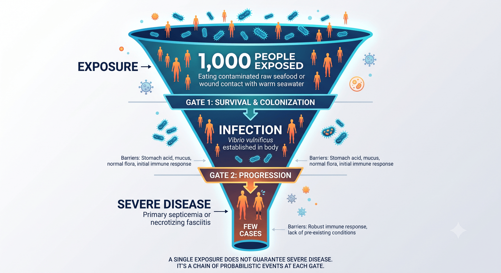
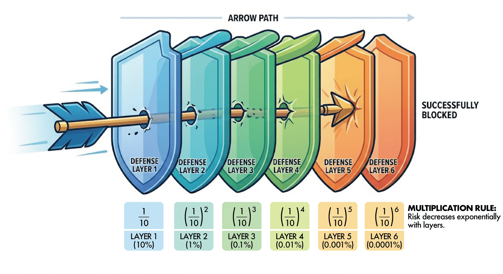
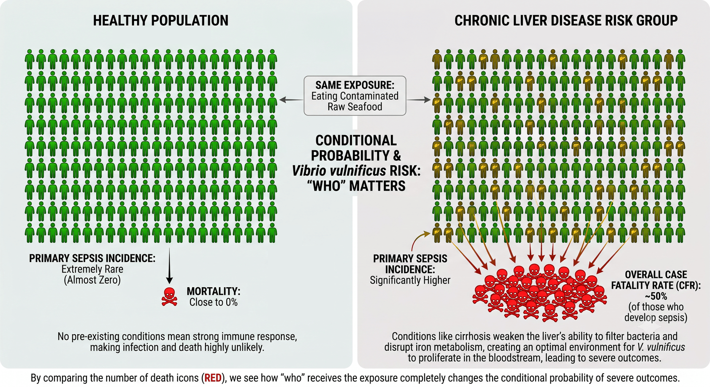
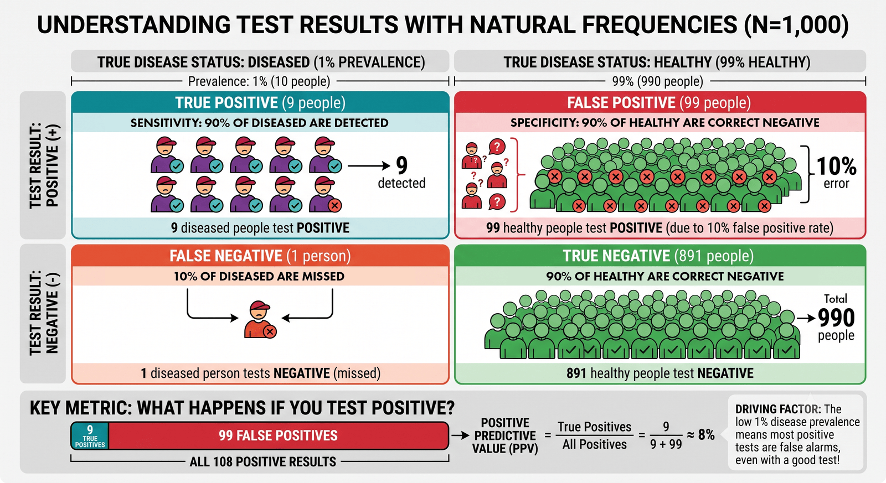
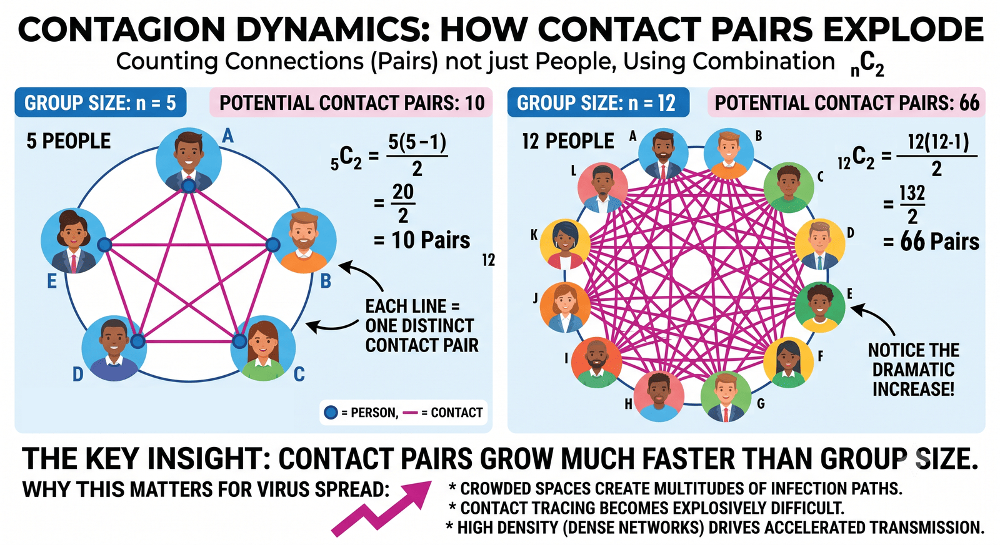

# 확률: 감염을 확률로 읽는다

## 0. 도입: 왜 감염미생물학 강의에서 '확률'을 알아야 하나?

지난 챕터에서 우리는 환경과 기후가 감염병 양상을 어떻게 바꾸는지 살펴보았다. 마지막 부분에서 우리는 두 개의 질문을 찾았는데, **"그래서, 얼마나 자주 걸리는데?"**, **"우리 병원엔 몇 명이나 올까?"** 이 두 질문에는 공통점이 있다. 둘 다 "그렇다/아니다"로 답할 수 없고, **"어느 정도의 가능성"** 으로만 답할 수 있다는 것이다. 감염병을 다루는 일이 결국 확률을 다루는 일인 이유가 여기에 있다.

한 학기 동안 우리가 외운 것들 — 어떤 세균이 어떤 병을 일으키고, 무엇으로 옮으며, 어떤 약을 쓰는지 — 은 대체로 **정적(static)인 지식**이다. 시험에 나오고, 반드시 기억해야 한다. 그런데 실제 임상에서 벌어지는 일, 즉 **병에 걸리고 또 낫는 과정**은 정적이지 않다. 같은 균에 같이 노출되어도 누구는 멀쩡하고 누구는 앓아눕는다. 같은 약을 같은 용량으로 써도 누구는 잘 낫고 누구는 부작용에 시달린다. 이 **동적(dynamic)인 과정**은 확률의 지배를 받는다.

가장 쉬운 예가 치료다. 어떤 치료법도 시도한 환자 전부를 100% 낫게 하지는 못한다. 약을 생각해 보자. 사람마다 이른바 '체질'이 달라 — 전문적으로는 대사 능력·수용체·면역 반응의 개인차를 의미한다 — 같은 약도 누구에겐 과하게 듣고 누구에겐 거의 듣지 않는다. 그래서 처방은 언제나 "이 약이 이 환자에게 들을 **가능성**"을 계산에 넣는다. 수술도 마찬가지다. 우리는 "이 수술을 하면 열에 일고여덟은 살고, 5년 뒤 생존율은 몇 퍼센트"라는 식으로 말한다. 이 표현 자체가 **어떤 치료도 확실(100%)이 아니라 확률**임을 인정하는 언어다.

왜 100%가 불가능한지는 챕터 1에서 배운 **다양성**으로 설명된다. 같은 종인 사람도 유전·면역·나이·기저질환·그날의 컨디션이 저마다 달라, 똑같은 자극에 똑같이 반응하지 않는다. 병원체 쪽도 마찬가지여서, 같은 균이라도 들어온 양과 독력(virulence), 침입 시점이 매번 다르다. 또한 같은 균종이라도 혈청형에 따라 서로 다른 성질을 갖는다는 것도 우리는 이미 알고 있다. 그래서 '이만큼 노출되면 반드시 이렇게 된다'는 결정론은 성립하지 않고, 우리가 말할 수 있는 것은 언제나 **가능성의 크기**뿐이다. 확률은 이 어쩔 수 없는 개인차·상황차를 다루는 언어다.

병에 걸리는 쪽도 대칭이다. 코로나19를 예로 들면, 감염자와 이야기를 나누다 그 사람의 비말이 묻은 물체를 손으로 만지고, 그 손으로 무심코 코나 입을 만져 살아 있는 바이러스 입자(virion)를 들이마시면 걸린다. 그런데 내가 마스크를 쓰고, 얼굴을 만지지 않으려 애쓰고, 상대도 마스크를 쓰고, 만난 뒤 손을 씻는다면? 그 하나하나가 바이러스가 내 몸에 닿을 **확률을 조금씩 낮춘다.** 그렇게 낮아진 확률들이 겹치면 나는 좀처럼 걸리지 않는 상태가 된다. 챕터 1의 도입에서 "접촉 확률을 낮추는 것이 최선의 예방"이라고 한 문장의 정확한 의미가 바로 이것이다 — **예방이란 확률을 낮추는 기술**이다.

그러니 간호사에게 확률은 남의 학문이 아니다. 수학이나 공학을 전공한 사람처럼 깊이 파고들 필요는 없다. 다만 확률이라는 개념 앞에서 **주눅 들거나 거부감을 느끼지 않고**, 상식보다 한 뼘 더 깊은 수준에서 그것을 다룰 수 있어야 한다. 그래야 "얼마나 자주", "누구에게", "몇 명이나"라는 질문에 근거를 가지고 답하고, 환자에게도 정확히 설명할 수 있다. 이번 챕터는 그 한 뼘을 위한 것이다. 공식을 외우는 시간이 아니라, **감염을 확률로 보는** 연습이다.

::: {.callout-note title="이 강의를 왜 간호사가 배우는가"}
확률은 두려운 수식이 아니라 **세상을 읽는 안경**이다. 이 안경을 끼면 "왜 예방을 한 겹이 아니라 여러 겹 하는가", "왜 같은 병인데 어떤 환자만 위중한가", "검사가 양성인데 왜 다시 확인하는가", "우리 병동에 몇 명이 올지 어떻게 가늠하는가"가 하나로 꿰인다. 오늘 배우는 것은 계산법이 아니라 **판단의 근거**다.
:::

---

## 1. 감염은 확률 사건이다 — 노출 ≠ 감염 ≠ 중증

먼저 가장 큰 오해 하나를 정리하자. **"병원체에 노출되면 병에 걸린다"** 는 생각이다. 정확하지 않다. 노출과 감염과 중증은 서로 다른 사건이고, 그 사이마다 **통과해야 넘는 관문**이 있으며, 각 관문의 통과는 확률이다.

비브리오패혈증으로 따라가 보자. 챕터 1에서 보았듯 *Vibrio vulnificus*는 따뜻한 바닷물에 사는 세균으로, 오염된 해산물을 날로 먹거나 상처가 바닷물에 닿을 때 사람에게 넘어온다. 이 과정을 세 관문으로 나눌 수 있다.

- **노출(exposure)**: 오염된 회를 먹었다, 또는 상처가 바닷물에 닿았다. 균과 만난 것.
- **감염(infection)**: 들어온 균이 죽지 않고 몸 안에 자리를 잡아 증식하기 시작했다.
- **중증(severe disease)**: 감염이 원발성 패혈증이나 괴사성 근막염 같은 치명적 형태로 진행했다.

핵심은 **한 관문을 넘었다고 다음 관문이 자동으로 열리지는 않는다**는 것이다. 오염된 회를 먹은 사람이 모두 감염되는 것도 아니고, 감염된 사람이 모두 패혈증으로 가는 것도 아니다. 위산과 점막, 정상 세균총, 면역계가 각 관문에서 균을 걸러내기 때문이다. 그래서 감염은 "노출되면 끝"인 일회성 사건이 아니라, **여러 확률이 연쇄로 걸린 사건**이다.

자연빈도로 그려 보면 이렇다. 오염된 회를 먹은 사람 1,000명이 있다고 하자. 그중 실제로 균이 자리를 잡는 사람은 일부이고, 감염된 사람 가운데 다시 일부만이 원발성 패혈증 같은 중증으로 진행한다. 관문을 지날 때마다 인원이 줄어드는 이 '깔때기'가, 노출과 발병 사이에 놓인 확률의 여러 단계를 한눈에 보여준다. 뒤에서 보겠지만 이 깔때기의 각 관문이 얼마나 좁은지는 사람마다 다르다 — 바로 그 차이가 4절의 주제다.

::: {.callout-note title="노출이 곧 발병은 아니다"}
오염된 회를 함께 먹은 열 명 가운데 며칠 안에 증상을 보이는 사람은 몇 명뿐이고, 나머지는 멀쩡할 수 있다. 여기서 놓치기 쉬운 두 가지가 있다. 첫째, **아직 증상이 없다고 안심할 수는 없다.** 교과서의 "노출 뒤 며칠 후 증상 발현"이라는 표현은 '대체로 그 무렵 나타난다'는 통계적 서술이어서, 잠복기가 길어 뒤늦게 발병하는 사람이 있다. 둘째, **그 시간이 지나도 끝내 증상이 없는 사람도 있다.** 식습관, 위산·간 대사, 면역 상태가 저마다 달라 분명히 *V. vulnificus*에 노출되고도 발병하지 않을 수 있다. 요컨대 "노출되면 병에 걸린다"는 항상 참인 명제가 아니라 **확률의 문제**다 — 발병 여부도, 발병 시점도 확률로 흩어진다.
:::

{#fig-c2-ch2-fig1-funnel-of-exposure-to-disease}

이렇게 보면 두 가지가 분명해진다. 첫째, **예방(prevention)은 이 관문들의 통과 확률을 낮추는 일**이다. 둘째, 같은 노출이라도 **누구냐에 따라 결과가 다르다** — 건강한 사람에게는 높은 관문이 간질환자에게는 낮다. 이 두 방향이 이번 챕터의 핵심이다.

::: {.callout-tip title="용어를 정확히"}
일상에서 우리는 "감염됐다"와 "병에 걸렸다"를 뒤섞어 쓰지만, 감염미생물학에서는 구분이 중요하다. **감염(infection)** 은 균이 자리 잡은 상태, **발병(disease)** 은 그 결과로 증상이 나타난 상태다. 감염되고도 증상이 없는 **무증상 감염(불현성 감염)** 이 흔하다는 사실 자체가, 노출과 발병 사이에 확률의 여러 단계가 있다는 증거다.
:::

::: {.callout-note title="감염량 — 노출의 '양'도 확률을 바꾼다"}
노출이 곧 감염이 아닌 또 하나의 이유는 **감염량(infectious dose)** 이다. 몸에 들어온 병원체가 많을수록 방어를 뚫고 자리 잡을 확률이 커진다. 병원체마다 대략 절반을 감염시키는 양($\mathrm{ID}_{50}$)이 있는데, 의미상 전체 사람 집단의 50%를 감염시키는데 필요한 병원체의 양을 의미한다. 이 값이 크면 50%의 사람을 감염시키는데 세균이 많이 필요하다는 뜻이고, 작으면 그만큼 적은 양의 세균에 노출되어도 사람 집단의 50%가 감염된다는 뜻이다. '얼마나 많이 노출됐나'라는 양의 문제까지 더해져, 노출→감염은 언제나 확률로 남는다.
:::

---

## 2. 방어는 확률을 곱해 낮추는 일 — 독립사건과 곱셈법칙

방어의 원리를 한 문장으로 줄이면 이렇다. **여러 겹의 방어는 각 겹이 뚫릴 확률을 곱한 만큼만 뚫린다.** 이 절은 그 '곱한다'는 말의 의미를 짚는다.

확률에는 두 사건이 **서로 영향을 주지 않을 때**(독립, independent), 두 사건이 **동시에 일어날 확률은 각각의 확률을 곱한 값**이라는 규칙이 있다. 이것을 **곱셈법칙(multiplication rule)** 이라 한다. 동전을 두 번 던져 둘 다 앞면일 확률이 $\frac{1}{2} \times \frac{1}{2} = \frac{1}{4}$인 것과 같은 이치다.

감염 방어에 그대로 적용해 보자. 어떤 병원체가 내 몸에 도달하려면 여러 방어막을 차례로 뚫어야 한다. 각 방어막이 뚫릴 확률이 예컨대 $\frac{1}{10}$이라 하자. 방어막이 하나면 뚫릴 확률은 1/10이다. 그런데 서로 독립인 방어막을 세 겹 세우면, 셋을 모두 뚫을 확률은

$$\frac{1}{10} \times \frac{1}{10} \times \frac{1}{10} = \frac{1}{1000} = 0.001$$

으로 급격히 작아진다. 방어막을 산술적으로 '더한' 게 아니라 확률을 '곱했기' 때문에, 겹을 하나 더할 때마다 남은 위험이 통째로 한 자릿수씩 줄어든다. 

{#fig-c2-ch2-fig2-barrier-arrow}

방어막이 꼭 $\frac{1}{10}$처럼 강력할 필요도 없다. 각각 절반만 막아 주는(통과 확률 $\frac{1}{2}$) 허술한 방어막이라도, 세 겹이면 통과 확률이 $\frac{1}{2} \times \frac{1}{2} \times \frac{1}{2} = \frac{1}{8}$로 떨어진다. 완벽한 방어막 하나를 찾는 것보다 **불완전한 방어막을 여러 겹 쌓는 편이 대개 더 현실적이고 더 강하다.** 감염관리가 손위생 하나에 매달리지 않고 손위생·마스크·환기·백신·격리를 함께 쓰는 이유가 이것이다.

비브리오로 옮겨 보자. 간질환이 있는 사람이 여름에 스스로를 지키는 방법은 하나가 아니다. **날 해산물을 피하고**(먹는 경로 차단), **상처가 있을 때 바닷물을 피하고**(상처 경로 차단), 먹더라도 **충분히 익혀 먹는다**(균 사멸). 각각이 완벽하진 않지만, 세 겹을 함께 지키면 노출→감염으로 이어질 확률이 곱으로 줄어든다. **COVID19** 로 보면, 마스크·거리두기·환기는 각각 접촉당 전파 확률을 낮추는 방어막이고, 함께 쓰면 그 확률이 곱으로 작아진다 — 어느 하나도 100%는 아니지만 여러 겹이면 충분히 낮아진다.

::: {.callout-note title="스위스 치즈 모형"}
이 '여러 겹' 아이디어를 의료안전에서는 **스위스 치즈 모형(Swiss cheese model)** 으로 부른다(Reason, 2000). 방어막 한 겹 한 겹에는 구멍(빈틈)이 뚫려 있지만, 여러 장을 겹쳐 놓으면 **구멍이 일렬로 관통할 확률**이 급격히 낮아진다는 그림이다. 손위생·표준주의·백신·격리는 저마다 구멍이 있는 치즈 한 장씩이고, 안전은 그것들을 **여러 겹 포개는 데서** 나온다.
:::

::: {.callout-caution title="주의사항 - 곱셈은 '이상적인 근사'다"}
곱셈법칙은 방어막들이 **서로 독립**일 때 정확하다. 현실의 방어막은 완전히 독립이 아니다. 예컨대 피곤해서 손위생을 건너뛰는 날은 마스크도 대충 쓰기 쉬워, 두 빈틈이 함께 열리는 경향이 있다(상관관계). 그래서 실제로 겹쳐진 방어의 위험은 단순한 곱보다 조금 클 수 있다. **방향(겹칠수록 급감)은 언제나 옳지만, 정확한 숫자로 단정하진 말자.** 이런 겸손이 확률을 제대로 쓰는 태도다.
:::

::: {.callout-note title="독립이 아닐 때는?"}
곱셈법칙은 사건들이 서로 독립일 때의 이야기다. 그런데 감염에서 정작 중요한 경우는 사건들이 **서로 얽혀 있을 때**다 — 특히 '이 사람이 위험군인가'라는 하나의 조건이 여러 확률을 한꺼번에 바꿔 놓을 때. 그 이야기가 4절의 조건부확률이다.
:::

---

## 3. 반복되면 쌓인다 — 누적 위험과 큰 수의 법칙

앞 절이 "한 번의 만남"을 다뤘다면, 이 절은 "만남이 반복될 때"를 다룬다. 여기서 흔히 뒤섞이는 **두 개념**을 분리해서 보자. 하나는 **반복되면 위험이 쌓인다**는 이야기(누적 위험)이고, 다른 하나는 **많이 반복하면 비율이 참값에 가까워진다**는 이야기(큰 수의 법칙)다. 둘은 다르지만 짝을 이룬다.

### (가) 누적 위험 — 한 번은 안전해도 반복되면 쌓인다

한 번의 노출로 걸릴 확률이 아주 낮다고 하자. 그렇다고 안심할 수 있을까? 한 번, 두 번은 대개 무사하다. 그러나 **노출이 반복되면 "적어도 한 번 걸릴" 확률은 조용히 올라간다.** 이것을 **누적 위험(cumulative risk)** 이라 한다.

셈법은 뒤집어 생각하면 쉽다. 한 번에 걸릴 확률이 $p$라면, **한 번에 안 걸릴** 확률은 $1-p$다. 노출이 $n$번인데 **한 번도 안 걸리려면** 매번 안 걸려야 하므로(앞 절의 곱셈법칙), 그 확률은 $(1-p)^{n}$이다. 따라서 **적어도 한 번 걸릴** 확률은

$$1-(1-p)^{n}$$

이다. $p$가 작아도 $n$이 커지면 이 값은 눈에 띄게 커진다.

간호 현장의 실제 숫자로 보자. **바늘 자상(needlestick)** 은 반복 노출의 대표적 예다. 미국 공중보건서비스 지침에 따르면, 감염원에 한 번 찔렸을 때 감염될 확률은 C형간염 바이러스(HCV)가 평균 약 **1.8%**, HIV가 약 **0.3%** 다(Centers for Disease Control and Prevention, 2001). 한 번만 보면 낮다. 그런데 HCV 1.8%를 **사고실험** 삼아 반복시켜 보면:

| 감염원에 찔린 횟수 | "적어도 한 번" 감염될 확률 |
|---|---|
| 1회 | 약 1.8% |
| 10회 | 약 17% |
| 40회 | 약 50% |
| 100회 | 약 84% |

한 번엔 2%도 안 되던 위험이, 같은 상황이 쌓이면 절반을 넘고 결국 대부분이 된다. (물론 실제로는 매번 감염원에 찔리는 것도 아니고 예방조치·백신·노출후예방이 개입하므로, 이 표는 "작은 확률도 반복되면 쌓인다"는 **원리를 보여주는 계산**일 뿐이다). 그래서 결론은 겁을 주자는 게 아니라 정반대다 — **바로 이 누적 때문에 표준주의(standard precaution)를 매번, 예외 없이 지킨다.** 한 번 한 번 $p$를 낮게 유지해야, 수천 번 반복되는 경력 전체에서도 누적 위험이 낮게 유지된다. B형간염처럼 **백신으로 노출→감염 확률 자체를 0에 가깝게 만들 수 있는** 경우 예방접종이 강력한 이유도 같다(한 번당 감염률이 6~30%로 높기 때문이다; Centers for Disease Control and Prevention, 2001).

::: {.callout-warning title="간호적 함의"}
"지난번에도 괜찮았으니 이번에도 괜찮겠지"는 확률적으로 위험한 추론이다. 각 사건이 독립이라면 **과거에 무사했다는 사실은 이번 위험을 조금도 낮춰 주지 않는다.** 낮은 확률의 사건도 반복 노출에서는 반드시 대비해야 하며, 그 대비가 바로 매번의 방어 습관이다.
:::

이 함정에는 이름도 있다 — **도박사의 오류(gambler's fallacy)**. '계속 무사했으니 이제 슬슬 걸릴 때가 됐다', 혹은 반대로 '지금까지 괜찮았으니 앞으로도 괜찮다' 두 방향 모두 틀렸다. 독립사건에서 과거의 결과는 다음 사건의 확률을 **전혀** 바꾸지 않는다. 동전이 앞면을 다섯 번 냈어도 여섯 번째가 앞면일 확률은 여전히 반이다. 감염 방어에서도 어제까지의 무사함은 오늘의 방어를 면제해 주지 않는다. 다만 반복 노출이 늘 독립인 것은 아니어서, 유행이 거세지는 시기에는 만날 때마다 감염 확률($p$) 자체가 올라가 누적 위험이 위 표보다 더 가파르게 커진다. 그래서 유행기에는 평소보다 방어를 한 겹 더 올리는 것이 합리적이다.

### (나) 큰 수의 법칙 — 많이 보면 비율이 참값에 가까워진다

이제 전혀 다른 이야기다. 동전을 열 번 던지면 앞면이 4번 나오기도, 7번 나오기도 한다. 비율이 0.4, 0.7로 들쭉날쭉하다. 그런데 만 번을 던지면 앞면 비율은 거의 어김없이 0.5 근처에 모인다. 이렇게 **시행을 아주 많이 반복하면 관측된 비율이 참 확률에 가까워지는** 현상을 **큰 수의 법칙(law of large numbers)** 이라 한다.

이 법칙이 왜 중요한가? 우리가 **"치명률 약 50%", "감염자 5명 중 1명 사망", "여름 등산객의 70%가 모기에 물림"** 같은 하나의 숫자를 믿고 인용할 수 있는 근거가 바로 이것이기 때문이다. 개인 한 명의 결과는 아무도 못 맞힌다 — 이 환자가 나을지 말지는 던지기 전의 동전 같다. 그러나 **집단의 비율은 놀랍도록 안정적**이어서, 충분히 많은 사례가 모이면 참값에 수렴한다. 그래서 역학 통계의 숫자는 신뢰할 수 있고, 우리는 그 숫자로 계획을 세운다.

작은 표본이 왜 못 미더운지도 같은 원리다. 어떤 여름 식중독 사건에서 오염된 음식을 먹은 사람이 몇 명뿐이면 '발병률'이 우연에 크게 휘둘려, 한두 명 차이로 30%가 되었다 60%가 되었다 한다. 그러나 수백·수천 명 규모의 자료가 쌓이면 그 발병률은 참값 주위로 안정된다. 교과서에서 보는 치명률·발병률 숫자가 대체로 큰 표본에서 나온 값인 것은 이 때문이며, 이는 곧 **작은 표본의 비율은 함부로 일반화하지 말라**는 경고이기도 하다.

::: {.callout-note title="두 개념은 다르다 — 그러나 짝을 이룬다"}
**누적 위험**은 "작은 $p$도 반복(횟수 $n$)이면 쌓인다"는 이야기이고, **큰 수의 법칙**은 "반복이 많으면 관측 비율이 참 $p$에 가까워진다"는 이야기다. 방향이 다르다. 하지만 둘은 맞물린다 — 큰 수의 법칙이 "$p$라는 숫자를 믿어도 된다"를 보증해 주기에, 우리는 그 $p$를 누적 위험 계산에 자신 있게 넣을 수 있다. (일상에서 "자꾸 하다 보면 언젠가 걸린다"는 말은 사실 **누적 위험** 쪽인데, 흔히 '큰 수의 법칙'이라 잘못 부른다. 이 강의에서는 둘을 구분해 쓴다.)
:::

---

## 4. 누구에게 일어나느냐가 확률을 바꾼다 — 조건부확률과 위험군

지금까지의 확률은 "평균적인 사람"을 상정했다. 그러나 감염에서 가장 중요한 사실 하나는, **같은 노출이라도 누구에게냐에 따라 확률이 통째로 달라진다**는 것이다. 이렇게 **어떤 조건이 주어졌을 때 달라지는 확률**을 **조건부확률(conditional probability)** 이라 한다. 감염관리에서 '조건'이란 대개 그 사람의 **위험군(risk group)** 여부다.

비브리오패혈증이 이 원리를 가장 극적으로 보여준다. 건강한 사람은 오염된 회를 먹어도 원발성 패혈증까지 가는 일이 드물다. 그러나 **간경변 같은 만성 간질환**이 있으면 이야기가 완전히 달라진다. 간이 약해지면 균을 걸러내는 능력과 철 대사가 무너져, *V. vulnificus*가 혈류에서 폭발적으로 증식하기 쉬운 몸이 되기 때문이다.

위험군은 간질환자만이 아니다. 과음, 당뇨, 면역억제 상태, 그리고 철분이 과도하게 쌓이는 혈색소증도 위험을 키운다. 특히 철은 *V. vulnificus*의 증식에 필요한 영양분이어서, 혈중 철이 많은 상태는 이 균에게 유리한 환경이 된다. 이처럼 '조건'은 하나가 아니라 여러 갈래이고, 각 조건이 노출→감염→중증으로 이어지는 문턱을 조금씩 낮춘다. 여러 조건이 겹친 환자는 관문이 여러 겹 낮아져 확률이 더욱 높아진다.

숫자를 사람으로 바꿔 보자. 오염된 회를 먹은 1,000명을 상상한다.

- 이 1,000명이 **모두 건강한 사람**이라면, 원발성 패혈증으로 진행하는 사람은 **거의 없다.**
- 이 1,000명이 **모두 간경변 환자**라면, 원발성 패혈증이 뚜렷이 늘고, **거기까지 간 사람의 절반 이상이 사망한다**(Bross et al., 2007).

::: {.callout-note title="_V. vulnificus_ 원발성 패혈증 발병 과정 요약"}
1. **면역 방어벽(망상내피계)의 붕괴** 우리 몸의 간에는 '쿠퍼 세포(Kupffer cell)'라는 강력한 면역 세포들이 존재한다. 장에서 흡수된 혈액이 간을 거칠 때, 쿠퍼 세포가 혈액 속의 세균을 걸러내는 필터 역할(망상내피계 방어)을 수행한다. 그러나 만성 간 질환자는 이 필터 기능이 망가져 있어, 장벽을 뚫고 들어온 비브리오균이 간에서 걸러지지 않고 그대로 온몸의 혈액으로 퍼져 원발성 패혈증을 일으킨다.
2. **세균의 먹이가 되는 '철분' 과다** 비브리오 패혈증균은 증식할 때 철분(Iron)을 필수 영양소로 삼아 폭발적으로 성장한다. 만성 간 질환이나 간경변이 있으면 간세포가 파괴되면서 혈액 내에 철분(혈청 철 및 페리틴) 농도가 정상인보다 비정상적으로 높아진다. 이 높은 철분 농도가 비브리오균에게는 최고의 배양이 되어, 균이 혈액 속에서 무서운 속도로 복제 및 증식한다.
3. **간문맥 고혈압으로 인한 장벽 약화** 간경변 등이 진행되면 간으로 들어가는 혈관의 압력이 높아지는 '간문맥 고혈압'이 발생한다. 이로 인해 장 점막이 붓고 장벽의 방어 기능(장관 장벽)이 느슨해진다. 결과적으로 어패류를 통해 들어온 비브리오균이 장벽을 통과해 혈관 내로 침투하기가 훨씬 쉬워진다.
:::

실제로 비브리오패혈증 사망자의 약 **80%가 간질환 등 기저질환자**이며(Bross et al., 2007), 감염자 전체로 보아도 **5명 중 1명이 사망**하는 치명적인 병이다(Centers for Disease Control and Prevention, 2024). 같은 회, 같은 균인데 **운명이 달라지는 지점이 '누구냐'** 라는 조건인 것이다. 공식은 필요 없다 — 그냥 1,000명 격자에서 사망자 수를 **직접 세어** 보면 두 집단의 차이가 눈에 보인다.

{#fig-c2-ch2-fig3-grid-of-thousand-people}

한 가지 개념을 더하자. 바로 **기저율(base rate)** 이다. 전체 인구로 보면 비브리오패혈증은 매우 드문 병이다. 그래서 여름철 발열·다리 통증 환자를 만나도 이 병을 **처음부터 의심하기가 어렵다.** 바로 그 드물다는 현상이 함정이다 — 드물기 때문에 놓치기 쉽고, 놓치면 급속히 진행해 손쓸 수 없게 된다. 조건부확률의 눈으로 보면 답은 분명하다. **환자가 위험군(간질환·과음·당뇨·면역저하)이라는 조건이 확인되는 순간, 이 드문 병의 확률은 급등한다.** 그러니 위험군에서는 의심의 문턱을 낮춰야 한다.

::: {.callout-warning title="간호적 함의"}
병력 청취가 왜 결정적인지가 여기서 드러난다. "회를 드셨나요"만이 아니라 **"간이 안 좋으시거나 술을 많이 드시나요"** 를 함께 물어야 한다. 같은 증상이라도 위험군이면 확률이 다르기 때문이다. 조기 의심과 신속한 항생제·외과적 처치가 생사를 가르는 병에서, **조건부확률을 읽는 눈이 곧 조기 의심의 근거**가 된다.
:::

::: {.callout-note title="임상 한 장면"}
늦여름, 두 환자가 비슷한 증상 — 발열과 다리의 붉은 수포성 병변 — 으로 응급실에 온다. 한 명은 평소 건강한 30대이고, 다른 한 명은 간경변 병력이 있으며 어제 회를 먹은 50대다. 증상은 닮았지만 **조건부확률은 전혀 다르다.** 후자에게는 비브리오패혈증의 확률이 급등하므로, 배양 결과를 기다리기 전에 이미 의심하고 신속히 대응해야 한다. 그래서, '누구냐'를 읽는 것이 대응을 몇 시간 앞당기고, 이 병에서는 그 몇 시간이 생사를 가른다.
:::

### 배양을 기다릴 수 없다면 — 신속 진단이라는 과제

참고로, 방금 임상 장면에서 "배양 결과를 기다리기 전에 대응"이라고 했는데, 바로 여기에 확률과 진단기술이 만나는 지점이 있다. 위험군이라는 조건은 이미 **사전확률(검사 전에 가늠하는, 병일 확률)** 을 크게 높여 놓았다 — 4절 전체가 그 이야기였다. 문제는 이 병을 확진하는 표준 방법인 **세균 배양**이 느리다는 데 있다. 균을 키우고 동정하기까지 보통 **하루 이상**이 걸리는데, 원발성 패혈증은 시간 단위로 급격히 진행해 치명률이 50%를 넘는다(Bross et al., 2007). **확진을 기다리는 사이에 환자를 잃을 수 있다**는 뜻이다.

그래서 임상에서는 두 가지를 동시에 한다. 첫째, 사전확률이 충분히 높으면 **확진 전에 경험적 치료를 시작**하면서 배양 검체를 함께 확보한다. 둘째, 배양보다 빠르게 병원체를 확인할 방법 — 유전자를 직접 검출하는 **실시간 유전자증폭검사(qRT-PCR)** 나 **신속항원검사** 같은 분자·신속 진단 — 을 꾸준히 개발하고 도입한다. 실제로 *V. vulnificus*의 특정 유전자(용혈독소 *vvhA* 등)를 겨냥한 실시간 PCR은 배양이나 기존 PCR보다 더 빠르면서도 민감하고 특이적으로 균을 잡아낸다고 보고되었다(Kim et al., 2008). 확률의 언어로 옮기면, 신속 진단은 **높은 사전확률을 몇 시간 안에 갱신·확인**해 결정을 앞당기는 도구다.

다만 빠르다고 완벽한 것은 아니다. 어떤 검사든 고유의 민감도·특이도가 있고, 배양은 항생제 감수성 정보까지 준다는 점에서 여전히 중요한 표준이다. 그러니 신속 진단은 배양의 **대체가 아니라 보완**이며, '그 결과를 얼마나 믿을 것인가'라는 물음이 곧 다음 절(5절)로 이어진다.

---

## 5. 양성이라고 다 환자는 아니다 — 자연빈도로 검사 읽기

임상에서 확률이 가장 자주, 그리고 가장 자주 **오해**되는 곳이 검사 결과다. "검사가 양성이면 병이 있는 것"이라는 생각은 틀리기 쉽다. 왜 그런지를 공식 없이, **사람 수를 세는 방법(자연빈도, natural frequency)** 으로 보자. 자연빈도로 제시하면 복잡한 확률 공식 없이도 의료진과 환자가 정확히 이해할 수 있다는 것은 잘 검증된 교육 방법이다(Gigerenzer & Hoffrage, 1995; Gigerenzer et al., 2007).

검사에는 세 가지 성질이 있다.

- **민감도(sensitivity)**: 진짜 환자를 양성으로 잡아내는 비율.
- **특이도(specificity)**: 건강한 사람을 음성으로 걸러내는 비율.
- **양성예측도(positive predictive value)**: 양성이 나온 사람이 **정말 환자일** 확률. — 임상에서 실제로 궁금한 것은 대개 이것이다.

여기서 결정적인 사실. **양성예측도는 그 병이 얼마나 흔한가(유병률, 곧 4절의 기저율)에 크게 좌우된다.** 드문 병일수록 양성예측도가 낮아진다. 숫자로 보자.

어떤 감염병의 유병률이 1%라 하자. 검사의 민감도 90%, 특이도 90%로 꽤 좋은 편이다. 1,000명을 검사하면:

- 실제 환자는 **10명**(1%). 이 중 민감도 90%로 **9명**이 양성(참양성), 1명은 음성(위음성).
- 건강한 사람은 **990명.** 이 중 특이도 90%이므로 10%인 **99명**이 양성(위양성).
- 그러면 **양성은 모두 $9 + 99 = 108$명.** 그런데 이 중 진짜 환자는 9명뿐이다.

즉 **양성예측도 $= 9/108 \approx 8\%$.** 검사가 양성이어도 실제 환자일 확률은 8%에 불과하고, 양성자의 92%는 사실 환자가 아니다. 검사가 나빠서가 아니라 — 민감도·특이도 90%는 좋은 검사다 — **병이 드물기 때문**이다.

이 1,000명을 네 칸으로 나눠 표로 보면 한눈에 들어온다.

| 유병률 1% | 실제 환자 | 실제 건강인 | 합 |
|---|---|---|---|
| **검사 양성** | 참양성 9 | 위양성 99 | 108 |
| **검사 음성** | 위음성 1 | 참음성 891 | 892 |
| **합** | 10 | 990 | 1,000 |

첫 줄(양성 108명)에서 진짜 환자는 9명뿐이다 — 양성예측도가 낮은 이유가 이 한 줄에 그대로 담겨 있다.

반대로 병이 흔하면 어떻게 될까? 똑같은 검사(민감도·특이도 90%)를 유병률 30%인 집단에 쓴다고 하자. 1,000명 중 환자가 300명, 건강한 사람이 700명이다. 참양성은 300명의 90%인 270명, 위양성은 700명의 10%인 70명이다. 양성 340명 가운데 진짜 환자가 270명이니 **양성예측도 $= 270/340 \approx 79\%$**로 뛴다. 검사 성능은 조금도 바뀌지 않았는데 양성예측도가 8%에서 79%로 달라졌다. **바뀐 것은 오직 기저율(유병률)뿐**이다. 그래서 '검사가 양성'이라는 정보는 반드시 '누구의 양성인가'와 함께 읽어야 한다.

{#fig-c2-ch2-fig4-false-positive}

::: {.callout-note title="4절과 같은 원리다"}
양성예측도는 결국 **"검사가 양성이라는 조건에서 환자일 조건부확률"** 이다. 그래서 4절의 기저율이 여기서도 지배한다. 위험군(사전확률이 높은 사람)에서 나온 양성은 믿을 만하지만, 저위험군에서 우연히 나온 양성은 위양성일 공산이 크다. **같은 양성이라도 누구의 양성이냐가 중요하다.**
:::

::: {.callout-warning title="간호적 함의"}
선별검사 양성은 **확진이 아니라 "확인검사가 필요하다는 신호"** 다. 환자에게 이 차이를 정확히 설명할 수 있어야 불필요한 공포와 과잉진단을 막는다. "양성이 나왔지만, 이 병은 드물어서 추가 검사로 확인해야 합니다"라는 한마디가 자연빈도의 실전 적용이다.
:::

### 두 가지 오류 — 위음성과 위양성

검사는 두 가지 방식으로 틀린다. **위음성(false negative)** 은 진짜 환자를 음성으로 놓치는 것이고, **위양성(false positive)** 은 건강한 사람을 양성으로 잘못 지목하는 것이다. 앞의 1% 표에서 위음성은 1명, 위양성은 99명이었다. 그런데 임상에서 이 둘의 **무게는 결코 같지 않다.**

- **위음성이 치명적인 병이 있다.** 비브리오패혈증처럼 급속히 진행하고 치명률이 높은 병에서는, 환자를 놓치는 위음성 한 건이 곧 사망으로 이어질 수 있다. 그래서 이런 병을 겨냥한 선별·신속 검사는 **놓치지 않는 능력(민감도)** 을 최우선으로 설계한다.
- **위양성도 공짜가 아니다.** 건강한 사람을 환자로 잘못 부르면 불필요한 치료·입원·불안, 그리고 확인검사 비용이 따른다. 드문 병을 온 집단에 무차별로 검사할수록 위양성이 참양성을 압도하는 것(앞의 8%)이 그 대가다.

여기에 피할 수 없는 맞교환이 있다. 민감도를 높이면 위음성이 줄지만 위양성이 늘고, 특이도를 높이면 그 반대다. 완벽한 검사는 없으므로, **어느 오류를 덜 감수할지를 병의 성질에 맞춰 고르는 것**이 핵심이다.

::: {.callout-note title="상황 예시 — 신속검사가 '음성'이라면"}
간경변 환자가 회를 먹은 뒤 열과 다리 통증으로 왔다. 4절에서 배운 대로 이 환자의 **사전확률은 이미 높다.** 신속검사를 했더니 **음성**이 나왔다 — 집으로 돌려보내도 될까? 아니다. 신속검사의 민감도가 완벽하지 않아 **위음성일 수 있고**, 무엇보다 사전확률이 높은 환자에서는 음성 한 번으로 병을 배제할 수 없다. 이럴 때는 관찰과 경험적 치료를 이어가며 배양으로 확인한다. **검사 결과는 사전확률 위에 얹어 읽는 것**이지, 그 하나로 판단을 뒤집는 것이 아니다.
:::

### 한 걸음 더 — 절대위험과 상대위험

확률을 환자에게 전할 때 가장 흔한 함정이 **상대위험(relative risk)** 이다. "이 습관이 병에 걸릴 위험을 2배로 높입니다"라는 말은 무섭게 들리지만, 정작 중요한 정보가 빠져 있다 — 원래 위험이 얼마였는가(기저율)다. 원래 위험이 1만 명 중 1명이었다면, 2배가 되어도 1만 명 중 2명이다. 실제로 늘어난 사람은 1만 명 중 1명뿐이다.

이처럼 **상대위험(몇 배인가)** 과 **절대위험(실제로 몇 명이 더 걸리는가)** 은 전혀 다른 이야기를 한다. 상대위험만 말하면 위험이 과장되어 들려 불필요한 공포나 과잉 대응을 부른다. 의료 통계를 정직하게 전하려면 **절대위험, 곧 '몇 명 중 몇 명'으로 말해야 한다**는 것이 검증된 권고다(Gigerenzer et al., 2007). 자연빈도가 검사 결과를 읽는 도구였다면, 절대위험은 위험을 **소통**하는 도구다 — 둘 다 '확률을 사람 수로 바꾼다'는 같은 정신에서 나온다.

::: {.callout-warning title="간호적 함의"}
환자 교육에서 "위험이 2배"라는 표현을 만나면 반드시 되물어야 한다. **"원래 얼마였는데 2배인가?"** 절대위험으로 바꿔 설명할 때 비로소 환자는 균형 잡힌 판단을 할 수 있다. 과장도 축소도 아닌 정직한 소통이 확률 문해력의 임상적 얼굴이다.
:::

---

## 6. 경우의 수 — 순열과 조합, 아주 조금

마지막 도구는 **경우의 수 세기**다. 고등학교에서 순열·조합을 배운 학생도 있고 아닌 학생도 있겠지만, 공식을 다시 풀 필요는 없다. 감염을 이해하는 데 필요한 것은 딱 하나 — **접촉할 수 있는 '짝'의 수는 사람 수보다 훨씬 빨리 늘어난다.**

한 공간에 사람이 $n$명 있다고 하자. 많은 경우에서 감염 전파는 결국 **두 사람이 만나는 짝(pair)** 에서 일어난다. 서로 다른 두 사람을 고르는 짝의 수는 순서를 따지지 않으므로 **조합(combination)** 이고, 그 수는 ${}_{n}\mathrm{C}_{2} = \binom{n}{2} = \dfrac{n(n-1)}{2}$다. 계산해 보면:

- **5명** → 짝 **10개**
- **10명** → 짝 **45개**
- **20명** → 짝 **190개**

사람이 2배(5→10)가 되면 짝은 4배 이상(10→45)이 된다. **사람 수는 산술적으로 늘지만 접촉의 기회는 훨씬 가파르게 늘어난다.** 밀집된 공간, 큰 모임, 붐비는 병동이 전파를 가속하는 이유가 이 셈에 있다. 접촉추적(contact tracing)이 확진자 한 명에서 시작해도 대상이 폭발적으로 불어나는 것도 같은 이유다.

숫자로 느껴 보자. 확진자 한 명이 하루에 10명과 접촉하고 그 10명이 각자 또 10명과 접촉한다면, 이틀 만에 좇아야 할 사람이 100명을 넘는다. 코로나19 확산세가 거세던 2020년 중반에 카드 사용내역까지 들여다볼 수 있도록 법을 개정하면서까지 추적하려던 것을 기억할 것이다. 방역이 초기의 **작은 수**일 때 총력을 기울이는 이유가 여기에 있다 — 짝과 경로의 수가 아직 셀 수 있을 때 끊어야 하기 때문이다.

**순열과 조합의 차이**도 감염 맥락에서 자연스럽다. **누가 먼저 누구를 옮겼는가**처럼 순서가 중요하면 **순열(permutation)** 이고(전파의 사슬), **그냥 어떤 두 사람이 접촉했는가**처럼 순서가 무의미하면 **조합**이다. 감염 기회를 셀 때는 대개 조합(짝)이 핵심이다.

::: {.callout-note title="순열·조합, 여기까지면 충분"}
공식을 외우지 말고 그림 하나만 기억하자. **점(사람)을 잇는 선(접촉)의 수**는 점이 늘수록 급격히 많아진다. 5개 점이면 10개 선, 10개 점이면 45개 선. "짝의 수가 사람 수보다 빨리 는다" — 이 직관 하나가 밀집의 위험을 설명한다.
:::

조금 더 현실적으로 설명하면, 조합의 문제는 항상 균질하지 않다. 앞서 설명한 경우의 수는 사람 집단을 구성한 사람들이 띄엄띄엄(sparse) 존재하면서 오며가며 만나는 정도로 보면 된다. 하지만 실제 사람들은 그렇게 흩어져 있지 않다. 대표적으로 여러분이 모여 있는 강의실을 예로 들 수 있고, 여러분의 하루 생활 중 밀집(dense)된 상태를 겪는 시간이 꼭 존재한다.

**실제 전파는 모든 짝에서 고르게 일어나지 않는다** 는 것이 바로 이런 의미이다. 소수의 사람·상황이 대부분의 전파를 일으키고 나머지는 거의 옮기지 않는, 매우 치우친(과대분산) 양상을 띤다 — 이른바 **초전파(superspreading)** 다(Lloyd-Smith et al., 2005). **COVID19** 로 익숙한 '3밀(밀폐·밀집·밀접)'이 위험한 이유가 정확히 이것이다. 짝의 수가 폭증하는 조건(밀집)에, 한 번에 여럿에게 퍼뜨릴 수 있는 상황(밀폐·밀접)이 겹치기 때문이다.

::: {.callout-warning title="간호적 함의"}
병상 간격 벌리기, 면회 제한, 코호트 격리, 다인실보다 1인실 — 감염관리의 익숙한 조치들은 사실 **접촉의 짝 수를 줄이는 일**이다. 사람을 나누고 사이를 벌리면 짝의 수가 급격히 줄어, 확진자 한 명이 만들 수 있는 전파 기회가 통째로 작아진다. "왜 굳이 나누고 떼어놓는가"의 답이 이 셈에 있다.
:::

{#fig-c2-ch2-fig5-network-and-group-size}

---

## 7. 그래서 몇 명이나 올까 — 기댓값, 그리고 다음 시간으로

이제 직전 챕터에서 던진 두 번째 질문, **"우리 병원엔 몇 명이나 올까?"** 에 답할 차례다. 답의 도구는 의외로 간단하다. **기댓값(expected value) = 인원 × 확률.**

예를 들어 어느 연안 지역 여름철에 위험 인구가 1만 명이고, 한 사람이 그 계절에 비브리오패혈증에 걸릴 확률이 0.02%라면, 예상 환자 수는 다음과 같다.

$$10{,}000 \times 0.02\% = 2$$

곧 평균 **2명**이다. 이 단순한 곱이 병상·인력·항생제·백신 물량을 미리 준비하는 계획의 언어다. 확률을 '몇 명'이라는 손에 잡히는 수로 바꿔 주기 때문이다.

이 곱셈의 쓸모는 조건이 바뀔 때 드러난다. 위험 인구와 계절 위험이 달라지면 예상 환자 수가 어떻게 변하는지 한눈에 볼 수 있다(예시).

| 위험 인구 | 계절 감염 확률 | 예상 환자 수(기댓값) |
|---|---|---|
| 5,000명 | 0.02% | 1명 |
| 10,000명 | 0.02% | 2명 |
| 10,000명 | 0.05% | 5명 |
| 20,000명 | 0.05% | 10명 |

해수온이 높아 감염 확률이 오르는 해(챕터 1에서 본 기후 신호)이거나 위험 인구가 많은 지역일수록 기댓값이 함께 오른다. 챕터 1의 '기후가 병의 지도를 바꾼다'가 여기서 '그래서 몇 명 더 온다'는 숫자로 번역되는 셈이다.

그러나 반드시 함께 기억할 것이 있다. **기댓값은 '평균'일 뿐, 실제로 일어나는 수는 매번 다르다.** 어떤 여름은 0명, 어떤 여름은 5명일 수 있다. 특히 6절에서 본 초전파처럼 전파가 치우쳐 있으면, 실제 숫자는 평균 주위로 더 크게 출렁인다. 그래서 기댓값 하나만 믿고 딱 그만큼만 대비하면, 평균을 웃도는 해에 무너진다.

왜 이렇게 출렁이는지는 감염의 성질에서 온다. 감염 사건은 서로 완전히 독립도 아니고 균일하지도 않다. 한 번의 초전파, 한 건의 오염 사고가 그해의 숫자를 통째로 끌어올릴 수 있다(예, 2020년 여름 COVID19가 어떤 종교시설에서 폭발적으로 확산한 사례 등). 그래서 '평균 2명'이라는 기댓값은 계획의 **출발점**이지 **보장**이 아니다. 실제 대비는 평균이 아니라 '나쁜 해에는 몇 명까지 갈 수 있는가'를 함께 보아야 하며, 그 물음이 곧 다음 시간에 다룰 분포의 물음이다.

::: {.callout-warning title="간호적 함의"}
기댓값으로 **평상시**를 준비하되, 반드시 **최악의 해(분포의 꼬리)** 를 함께 대비해야 한다. "평균 2명"은 "항상 2명"이 아니다. 평균을 계획의 출발점으로 삼되, 그 위의 변동을 위한 여유(병상·인력·물자)를 남겨 두는 것이 확률을 아는 사람의 대비다.
:::

### 곁들임 — 한 사람이 몇 명에게? 감염재생산수 (COVID19 사례)

기댓값의 가장 유명한 사례가 감염병 안에 있다. 바로 **감염재생산수(reproduction number)** 다. 한 명의 감염자가 **평균 몇 명에게 옮기는가** — 이 '평균 몇 명'이 곧 기댓값이다. 유행 초기, 아직 아무도 면역이 없을 때의 이 값을 $R_0$(기초감염재생산수)라 부른다.

이 숫자의 힘은 1을 기준으로 나뉜다. $R_0$가 1보다 크면 한 명이 한 명 넘게 옮기므로 유행이 커지고, 1보다 작으면 점점 꺼진다. COVID에서 우리가 마스크·거리두기·환기로 한 일이 바로 이 값을 **1 아래로 끌어내리는 것**이었다. 2절의 곱셈을 떠올리면 이해가 쉽다 — 접촉당 전파 확률을 낮추고(방어막), 6절에서 본 접촉의 수를 줄이면(밀집 완화), 그 곱으로 정해지는 '평균 전파 인원'이 함께 내려간다.

**집단면역(herd immunity)** 도 같은 셈이다. 인구의 상당 부분이 감염이나 백신으로 면역을 가지면, 감염자가 만나는 사람 중 실제로 걸릴 수 있는 사람의 비율이 줄어 유효한 전파 인원이 1 아래로 떨어진다. 잘 퍼지는 병($R_0$가 큰 병)일수록 더 많은 사람이 면역을 가져야 이 문턱을 넘는다. 3절에서 본 백신의 힘 — 노출→감염 확률 자체를 낮추는 것 — 이 개인을 넘어 집단 전체의 유행을 끄는 데까지 닿는 이유가 여기에 있다.

(다만 비브리오패혈증에는 이 셈이 적용되지 않는다. 사람 간 전파가 없어 $R_0$나 집단면역 개념 자체가 성립하지 않기 때문이다. 이 대목에서만 COVID를 잠깐 빌려 왔다.)

이제 우리는 기댓값으로 얼마나 많은 사람이 감염될 수 있는지 예상하는 것이 가능해졌다. 그런데, 인생사가 모두 우리 예상대로 되는 경우가 과연 얼마나 될까? 기댓값이라는 **하나의 수**로는 "평균은 2명"까지밖에 말하지 못한다. "그런데 0명일 확률은? 5명 이상일 확률은?"에 답하려면 지금까지 알아본 개념으로는 뭔가 부족하다. 이제 우리는매번 다른 결과들을 **모양으로 펼친 그림 — 분포(distribution)** 가 필요하다. 챕터 3에서 우리는 "같은 여름을 100번 돌리면 매번 몇 명이 나오는가"를 그려, 하나의 기댓값을 하나의 분포로 확장한다.

---

## 마무리 — 확률에 100%는 없다

오늘의 이야기를 한 문장으로 줄이면 이렇다. **감염도, 치료도, 방어도 100%가 없는 확률의 세계이며, 그 확률을 읽는 눈이 곧 대비의 시작이다.**

우리는 감염을 하나의 사건이 아니라 여러 관문의 확률로 보았고(1절), 방어란 그 관문의 통과 확률을 **곱해서** 낮추는 일임을 확인했다(2절). 작은 확률도 반복되면 쌓이지만, 그럼에도 집단의 비율은 안정적이어서 우리가 인용하는 숫자를 믿을 수 있음을 보았다(3절). 같은 노출이라도 **누구냐** 라는 조건이 확률을 바꾸고(4절), 검사 결과조차 그 조건(기저율) 위에서 읽어야 하며(5절), 사람이 모이면 접촉의 짝이 훨씬 빠르게 늘어 전파가 가속됨을(6절), 끝으로 그 모든 확률을 '몇 명'이라는 기댓값으로 바꿔 대비하되 평균 너머의 변동까지 내다봐야 함을(7절) 배웠다.

확률 개념에 대해 이해한 간호사는 무엇이 달라지는가. **한 겹 더 방어하고**(곱셈의 힘을 알기에), **조금 더 일찍 의심하고**(조건부확률과 기저율을 읽기에), **환자에게 더 정확히 설명한다**(양성이 곧 확진이 아님을, 평균이 곧 보장이 아님을 알기에). 확률 문해력은 계산 실력이 아니라 이런 **판단과 소통의 힘**이다. 여러분이 확률을 계산할 수 있다면 훨씬 좋겠지만, 직무와 일상에서 확률은 감각으로 이해하고 실제 행하는 것이 훨씬 더 중요하다.

오늘 배운 것을 현장에서 꺼내 쓰는 순간은 구체적이다. 방어를 설계할 때는 '한 겹을 더하면 위험이 곱으로 준다'(2절)를 떠올리고, 반복되는 노출 앞에서는 '작아도 쌓인다, 그러나 지난번의 무사함이 이번을 지켜 주진 않는다'(3절)를 기억한다. 낯선 증상 앞에서는 '이 사람은 누구인가 — 위험군인가'(4절)를, 검사지를 든 손으로는 '이 양성은 얼마나 믿을 만한가'(5절)를 묻는다. 붐비는 병동에서는 '짝의 수를 줄이자'(6절)로 움직이고, 다음 계절을 준비할 때는 '평균으로 시작하되 최악을 남겨 두자'(7절)로 대비한다. 확률은 이렇게 **판단의 매 순간에 스며드는** 도구다.

그리고 여기서 자연스러운 다음 질문이 생긴다. 기댓값이 "평균 2명"이라면, **0명일 가능성은, 5명을 넘을 가능성은 얼마인가?** 하나의 확률로는 여기까지 답할 수 없다. 그 매번 다른 결과들을 하나의 그림으로 펼친 것이 **분포**이며, 다음 시간(14주차, 챕터 3)의 주제다. 챕터 1에서 '분포의 이동'으로 병의 지도가 북상하는 것을 보았듯, 이제 그 분포를 직접 그려 **미래를 내다보고 전략의 효과를 가늠하는 법**을 배운다. 환경을 이해하고(챕터 1), 확률로 읽고(챕터 2), 분포로 내다보는(챕터 3) 세 걸음이 모여야, 변하는 세계에 대한 우리의 대비가 완성된다.

> 확실한 것은 없다. 그러나 확률을 읽을 줄 아는 간호사는, 불확실한 세계에서도 **어디에 한 겹을 더 쌓고 누구를 먼저 의심할지**를 안다. 그것이 확률을 배우는 이유다.

---

## 핵심 용어 (이 강의에서 새로 잇는 개념)

| 용어 | 영문 | 한 줄 정의 |
|---|---|---|
| 확률 | probability | 어떤 사건이 일어날 가능성의 크기(0~1) |
| 독립사건 | independent events | 한쪽 결과가 다른 쪽에 영향을 주지 않는 사건 |
| 곱셈법칙 | multiplication rule | 독립인 사건들이 모두 일어날 확률 = 각 확률의 곱 |
| 여사건 · 누적 위험 | complement · cumulative risk | 반복 노출에서 '적어도 한 번' 일어날 확률 $= 1-(1-p)^{n}$ |
| 큰 수의 법칙 | law of large numbers | 시행이 많아질수록 관측 비율이 참 확률에 수렴 |
| 조건부확률 | conditional probability | 어떤 조건(예: 위험군)이 주어졌을 때 달라지는 확률 |
| 기저율 | base rate | 전체에서 그 사건이 원래 얼마나 흔한가(유병률) |
| 민감도 · 특이도 | sensitivity · specificity | 환자를 양성으로 / 건강인을 음성으로 잡아내는 비율 |
| 양성예측도 | positive predictive value | 양성일 때 정말 환자일 확률(기저율에 좌우됨) |
| 위양성 · 위음성 | false positive · false negative | 건강인을 양성으로 / 환자를 음성으로(놓침) |
| 자연빈도 | natural frequency | 확률을 '사람 수'로 바꿔 세는 표현법 |
| 순열 · 조합 | permutation · combination | 순서를 따지는 / 따지지 않는 경우의 수 |
| 기댓값 | expected value | 평균적으로 기대되는 값 = 인원 × 확률 |
| 상대위험 · 절대위험 | relative · absolute risk | 몇 배인가 / 실제로 몇 명이 더 걸리는가 |
| 감염재생산수 | reproduction number ($R_0$) | 한 감염자가 평균 몇 명에게 옮기는가(기댓값) |
| 초전파 | superspreading | 소수의 사람·상황이 전파 대부분을 일으키는 치우침 |

---

## 참고문헌 (References)

Bross, M. H., Soch, K., Morales, R., & Mitchell, R. B. (2007). Vibrio vulnificus infection: Diagnosis and treatment. *American Family Physician, 76*(4), 539–544.

Centers for Disease Control and Prevention. (2001). Updated U.S. Public Health Service guidelines for the management of occupational exposures to HBV, HCV, and HIV and recommendations for postexposure prophylaxis. *MMWR Recommendations and Reports, 50*(RR-11), 1–52. https://www.cdc.gov/mmwr/preview/mmwrhtml/rr5011a1.htm

Centers for Disease Control and Prevention. (2024, May 13). *Clinical overview of vibriosis*. U.S. Department of Health and Human Services. https://www.cdc.gov/vibrio/hcp/clinical-overview/index.html

Gigerenzer, G., Gaissmaier, W., Kurz-Milcke, E., Schwartz, L. M., & Woloshin, S. (2007). Helping doctors and patients make sense of health statistics. *Psychological Science in the Public Interest, 8*(2), 53–96. https://doi.org/10.1111/j.1539-6053.2008.00033.x

Gigerenzer, G., & Hoffrage, U. (1995). How to improve Bayesian reasoning without instruction: Frequency formats. *Psychological Review, 102*(4), 684–704. https://doi.org/10.1037/0033-295X.102.4.684

Kim, H. S., Kim, D. M., Neupane, G. P., Lee, Y. M., Yang, N. W., Jang, S. J., Jung, S. I., Park, K. H., Park, H. R., Lee, C. S., & Lee, S. H. (2008). Comparison of conventional, nested, and real-time PCR assays for rapid and accurate detection of Vibrio vulnificus. *Journal of Clinical Microbiology, 46*(9), 2992–2998. https://doi.org/10.1128/JCM.00027-08

Lloyd-Smith, J. O., Schreiber, S. J., Kopp, P. E., & Getz, W. M. (2005). Superspreading and the effect of individual variation on disease emergence. *Nature, 438*(7066), 355–359. https://doi.org/10.1038/nature04153

Reason, J. (2000). Human error: Models and management. *BMJ, 320*(7237), 768–770. https://doi.org/10.1136/bmj.320.7237.768
