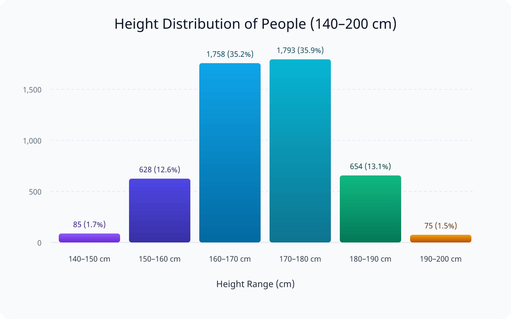
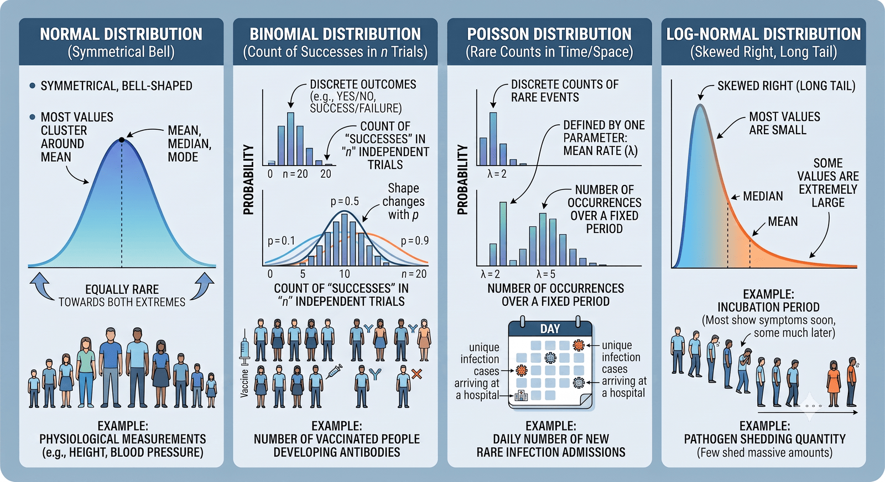
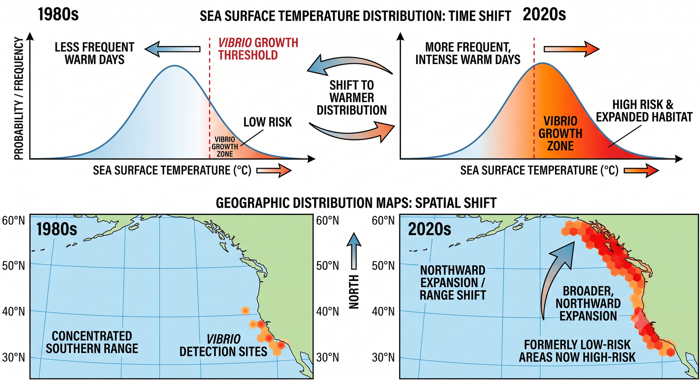
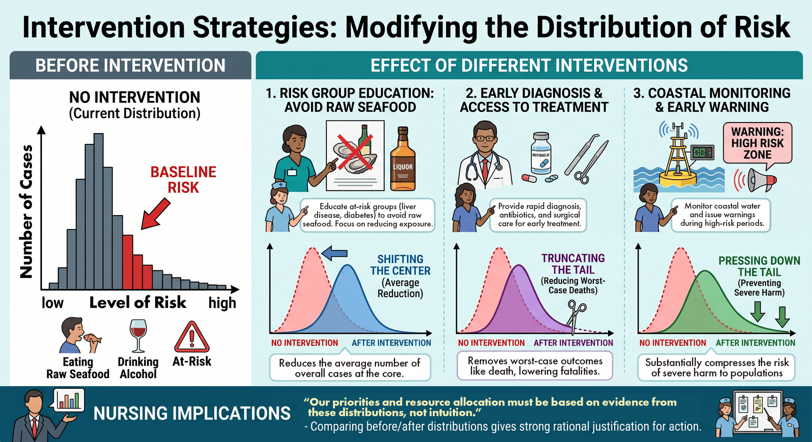

# 분포: 흩어진 미래를 모양으로 읽는다

```{julia}
#| echo: false
#| output: false
using ImModelling
```

## 0. 도입: 왜 감염미생물학 강의에서 '분포'를 알아야 하나?

지난 챕터 마지막에서 우리는 기댓값이라는 개념을 배웠고, "우리 병원엔 몇 명이나 올까?"에 "평균 2명"이라 답했다. 그리고 곧바로 더 어려운 질문 하나를 만났다. **"그런데 0명일 가능성은? 5명을 넘을 가능성은?"** 하나의 숫자, 곧 평균 하나로는 여기까지 답할 수 없다. 어떤 여름은 0명이고 어떤 여름은 5명일 텐데, 그 **매번 다른 결과들을 한 장의 그림으로 펼친 것**이 바로 오늘의 주제, **분포(distribution)** 다.

분포가 왜 그렇게 중요한가? 사실 우리는 지난 두 챕터 내내 확률로 무언가를 "안다"고 말해 왔는데, **확률로 안다는 것의 정체가 곧 분포를 읽는 일**이기 때문이다. 어떤 일의 확률을 안다는 것은, 가능한 결과들을 죽 늘어놓았을 때 **가장 큰 가능성으로 나타나는 결과는 어디에 몰려 있고(봉우리), 아주 작은 확률로만 나타나는 결과는 어디 끝에 드물게 걸려 있는지(꼬리)** 를 안다는 뜻이다. 감염병도 똑같다. 병에 걸릴 수 있는 사람들의 상태(나이·기저질환·노출)를 기준으로 결과의 분포를 그릴 수 있다면, 우리는 그 분포에서 확률을 읽어 **앞으로 무슨 일이 얼마나 일어날지 예측**할 수 있다. 이 예측의 가장 기본이 되는 도구가 바로 분포를 이해하는 것이다.

{#fig-c3-ch3-fig1-height-histogram}

그래서 오늘 우리는 기댓값이라는 **점 하나**에서 분포라는 **펼쳐진 면**으로 넘어간다. 그리고 이 면을 세 가지로 활용한다 — 분포의 **모양을 읽고**(무엇이 흔하고 무엇이 드문가), 그 모양으로 **미래를 예보하고**(일기예보처럼), 밖에서 영향을 주면 그 모양이 어떻게 **바뀌는지를 미리 시험한다**(전략의 효과).

한 가지만 미리 짚어 두자. 이번 챕터에서 '분포'라는 말은 서로 다른 두 가지를 가리킨다. 하나는 방금 이야기한 것으로, **결과가 얼마나 들쭉날쭉한지**를 그린 그림이다 — 어떤 여름은 환자가 많고 어떤 여름은 적은, 그 오르내림을 한데 모은 모습이다. 다른 하나는 그 분포를 **지도 위에 펼친 것**으로, 챕터 1에서 본 것처럼 병이 자주 생기는 자리가 넓어지고 세월과 함께 옮겨가는 모습이다. 언뜻 달라 보이는 이 둘이 실은 '분포가 움직인다'는 하나의 이야기임을, 오늘 강의에서 확인하게 된다.

::: {.callout-note title="이 강의를 왜 간호사가 배우는가"}
분포는 어려운 통계가 아니라 **미래를 예측할 수 있는 도구**이다. 이 도구를 쓸 줄 알면 "평균은 2명이라지만 최악의 해엔 몇 명까지 갈까", "올여름 비브리오 위험은 어느 정도일까", "우리가 이 대책을 쓰면 실제로 몇 명이 줄까"와 같은 질문에 합리적인 답을 할 수 있다. 오늘 배우는 것은 통계 계산법이 아니라, **불확실한 미래를 앞서 준비하는 눈**이다.
:::

---

## 1. 분포란 무엇인가 — 모양으로 보기

분포란 거창한 게 아니다. **일어날 수 있는 결과들을 죽 늘어놓고, 각각이 얼마나 자주 나타나는지를 함께 그린 것**이다. 결과를 가로축에, 그 결과가 나타나는 빈도(또는 확률)를 세로축에 두고 막대로 쌓으면 **히스토그램(histogram)** 이 되는데, 이 히스토그램의 '생김새'가 곧 분포다. 우리는 오늘 수식은 한 줄도 풀지 않는다. **오직 이 생김새만** 본다.

생김새를 읽는 데는 세 가지 눈금만 있으면 된다.

- **중심(center)** — 봉우리가 어디에 있나. 가장 흔한, 가장 그럴듯한 결과다. 지난 챕터의 기댓값(평균)이 대개 이 근처에 온다.
- **퍼짐(spread)** — 결과가 좁게 모여 있나, 넓게 흩어져 있나. 퍼짐이 크면 "매번 크게 다르다"는 뜻이다.
- **꼬리(tail)** — 양 끝, 혹은 한쪽 끝에 드물게 걸리는 극단적 결과. 자주 없지만 일어나면 큰 사건이다.

비브리오패혈증으로 그려 보자. 우리나라에서 2001년부터 현재까지의 비브리오패혈증 발병 환자 수 데이터를 이용해서 히스토그램으로 표현한 것이 그림 OO이다. 대부분의 여름은 몇 명 안팎(중심)에 몰려 있을 것이고, 아주 드물게 유난히 많은 해가 오른쪽 꼬리에 걸릴 것이다. 이 그림 한 장이 "보통의 여름은 이렇고, 나쁜 여름은 이만큼까지 간다"를 통째로 말해 준다. 평균 하나로는 결코 담을 수 없는 정보다(물론, 평균에 표준편차를 함께 표시하면 어느 정도 범위를 알 수 있지만 정확한 양상 파악은 역시 불가능하다).

사실 우리는 이 '모양 읽기'를 챕터 1에서 이미 한 번 했다. 어떤 지역의 여름 기온을 수십 년 모아 그리면 **가운데가 불룩한 종 모양**이 되고, 대부분의 날은 가운데(평범한 날)에 몰리며 기록적 폭염은 오른쪽 꼬리에 드물게 걸린다고 했다. 그때 기온에 대해 했던 그 읽기를, 오늘은 병에 대해 하는 것뿐이다.

::: {.callout-tip title="왜 '모양'이 그렇게 중요한가"}
평균은 "가운데가 어디냐"만 말한다. 그러나 간호와 방역에서 정작 중요한 질문은 대개 **꼬리**에 있다 — "최악의 해엔 몇 명까지?", "이 검사에서 놓치는 드문 환자는?". 분포의 모양을 보면 중심과 꼬리를 **한눈에** 볼 수 있고, 그래서 평균만 볼 때는 안 보이던 위험이 드러난다.
:::

```{julia}
#| label: fig-ch3-vibrio
#| fig-cap: "_V. vulnificus_ 패혈증 연도별 발병 빈도 분석(Data출처: 감염병포털)"
vibrio_year_histogram()
```

---

## 2. 분포에도 이름이 있다 — 네 가지 얼굴, 그리고 하나 더

분포의 생김새는 상황에 따라 몇 가지 전형적인 모양으로 나타나고, 자주 나오는 모양에는 **이름**이 붙어 있다. 분포의 가짓수는 매우 다양하지만, 여기서는 우리가 현업에서 자주 볼 네 가지를 먼저 보고, 봉우리가 둘인 특별한 경우 하나를 더 살펴본다. 먼저 볼 네 가지는 놀랍게도 넷 다 우리가 지난 두 챕터에서 **이미 만난** 것들이다.

::: {.callout-note title="분포와 확률, 그리고 통계"}
여러분이 고학년으로 진급하면 연구 교과목에서 통계를 접할 것이고, 거기서는 전문적으로 확률과 분포 양상을 수치로 계산하는 작업을 하게 된다. 귀무가설과 대립가설을 두고 어느 쪽이 더 그럴듯한지 판단하는 등 통계적 추론(reasoning) 과정에서 반드시 확률을 쓰며, 그 개념은 이 챕터에서 공부하는 것과 똑같은 것이다. 여기서 이해를 잘 해두면 나중 통계학 접근에 유리하다.
:::

### (가) 정규분포 — 대칭 종 모양

**정규분포(normal distribution)** 는 가운데가 가장 높고 양옆으로 대칭으로 낮아지는 **종(bell) 모양**이다. 평균 둘레에 대부분이 몰리고, 평균에서 멀어질수록 양쪽으로 똑같이 드물어진다. 키·혈압·체온처럼 **여러 자잘한 요인이 더해져 만들어지는 연속적인 측정값**이 흔히 이 모양을 띤다. 앞 절에서 본 챕터 1의 여름 기온 종 모양이 바로 정규분포다. "평균 근처가 가장 흔하고 양극단이 대칭으로 드물다"는, 분포의 가장 기본형이라 할 수 있다.

### (나) 이항분포 — 예/아니오를 여러 번 셀 때

**이항분포(binomial distribution)** 는 **예/아니오(성공/실패)로 답이 구분되는 시도를 정해진 횟수만큼 했을 때, '예'가 몇 번 나오는지**의 분포다. 예를 들어 백신을 맞은 20명 중 항체가 형성된 사람 수, 오염된 회를 먹은 10명 중 실제로 발병한 사람 수가 이항분포를 따른다. 사실 우리는 챕터 2에서 이 분포를 이미 계산했다 — 한 번에 걸릴 확률이 $p$일 때 $n$번 노출에서 **한 번도 안 걸릴** 확률 $(1-p)^{n}$, 따라서 **적어도 한 번 걸릴** 확률 $1-(1-p)^{n}$을 구했는데, 이 "$n$번 중 몇 번"이 바로 이항분포의 언어다. 누적 위험이란 결국 이항분포의 한쪽 끝을 본 것이었다.

### (다) 푸아송분포 — 드문 일이 몇 건이나 터지나

**푸아송분포(Poisson distribution)** 는 **드물게 일어나는 사건이 일정한 기간이나 공간에서 몇 건이나 일어나는가**의 분포다. 한 병동에 하루 동안 들어오는 특정 감염 환자 수, 한 연안에서 한 여름에 신고되는 비브리오패혈증 건수처럼, "드문데 셀 수 있는 것"의 개수가 이 모양을 띤다. 이 분포는 **평균 발생 건수 하나**로 모양이 정해진다. 그리고 이 평균이 바로 챕터 2 마지막에서 구한 **기댓값**이다 — 위험 인구 1만 명 × 계절 확률 0.02% = **평균 2명**. 여기서 "평균 2명"은 항상 2명이라는 뜻이 아니라, 어떤 해는 0명, 어떤 해는 5명이 되는 그 결과들의 흩어짐이 곧 푸아송 분포의 모양이라는 뜻이다. **"분포로 확률을 계산해 예측한다"는 오늘의 목표에 가장 직접 쓰이는 도구**가 이 푸아송이다.

### (라) 로그노멀분포 — 대부분은 작고, 드물게 아주 큰

**로그노멀분포(log-normal distribution)** 는 **왼쪽(작은 값)에 대부분이 몰려 있고 오른쪽으로 길게 꼬리가 늘어지는**, 한쪽으로 치우친 모양이다. 값들이 더해지는 게 아니라 **곱해지며 커지는** 상황에서 나타난다. 감염병에서 가장 잘 알려진 예가 **잠복기**다 — 대부분의 사람은 노출 뒤 비슷한 시일 안에 증상이 나오지만, 일부는 훨씬 늦게 나타나 오른쪽으로 긴 꼬리를 만든다(챕터 2에서 "잠복기가 길어 뒤늦게 발병하는 사람이 있다"고 한 그 현상이다; Sartwell, 1950). 개인마다 다른 병원체 배출량도 비슷하게 치우쳐 있다. 이 "긴 꼬리"는 3절에서 볼 **초전파(superspreading)** — 소수의 사람·상황이 전파 대부분을 일으키는 치우침(챕터 2의 6절; Lloyd-Smith et al., 2005) — 와도 통하는 모양이며, 나중에 "왜 평균만 믿으면 안 되는가"의 근거가 된다.

이 이름들을 외워 공식을 풀 필요는 전혀 없다. 목적은 딱 하나, **알아보는 것**이다. 나중에 여러분이 논문이나 질병청 자료의 그래프를 볼 때, 좌우 대칭 종 모양이면 "정규구나, 평균이 대푯값이겠네"라고 읽고, 오른쪽으로 길게 늘어져 있으면 "치우쳐 있으니 평균보다 큰 값이 드물게 튄다, 꼬리를 조심해야겠다"라고 읽으면 된다. 이 인식만으로도 데이터를 대하는 눈이 상식보다 한 뼘 깊어진다.

{#fig-c3-ch3-fig3-distribution-examples}

### (마) 봉우리가 둘인 분포 — 이봉분포

앞의 네 가지는 모양은 저마다 달라도 **봉우리가 하나**라는 공통점이 있었다. 그런데 봉우리가 **둘**인 분포도 있다. 가운데가 옴폭 꺼지고 양옆에 산이 두 개 솟은 모양인데, 이것을 **이봉분포(二峰分布, bimodal distribution)** 또는 쌍봉분포라 한다.

가장 가까운 예가 우리나라의 **사계절 기온**이다. 일 년치 기온을 하루도 빠짐없이 모아 쌓으면 봉우리가 둘로 나타난다 — 하나는 더운 여름 쪽에, 다른 하나는 추운 겨울 쪽에. 정작 그 중간인 선선한 날씨(봄·가을 기온)는 오히려 드물어 가운데가 파인다.

왜 이렇게 될까? 기온이 일 년 동안 오르내리는 모습을 **그네**에 빗대면 쉽다. 그네는 양 끝, 곧 가장 높이 오른 자리에서 잠깐 멈칫하며 가장 느리게 움직이고, 한가운데를 지날 때 제일 빠르게 스쳐 간다. 그래서 그네가 **머무는 시간은 양 끝에서 길고 가운데에서 짧다.** 우리 기온도 똑같다. 한여름의 더위와 한겨울의 추위에는 제법 오래 머무는 반면, 그 사이를 잇는 봄·가을은 빠르게 지나가 버린다. 그러니 여름값과 겨울값에는 날수가 수북이 쌓이고 중간값에는 얼마 쌓이지 않아, 봉우리가 둘로 나뉜다.

여기에 이봉분포의 진짜 뜻이 있다. **봉우리가 둘이라는 것은 대개 "성질이 다른 두 무리가 한데 섞여 있다"는 신호다.** 우리나라 기온에는 사실상 '여름이라는 상태'와 '겨울이라는 상태'가 섞여 있고, 그 둘이 각각 봉우리 하나씩을 만든 것이다(일 년 내내 기온이 비슷한 열대 지방이라면 봉우리는 하나뿐이다).

```{julia}
#| label: fig-ch3-seoul-temp
#| fig-cap: "서울 기온 이봉분포 패턴."
seoul_temp_bimodal()
```

간호 현장에도 이봉분포는 의외로 자주 나타난다.

- **감염병으로 인한 중증·사망의 나이 분포**가 양 끝이 높은 모양(U자형)을 띠는 일이 흔하다. 폐렴이나 인플루엔자처럼 아주 어린 영유아와 고령자에게서 위험이 크고 건강한 젊은 층에서 낮다. 챕터 2에서 배운 '위험군'이 나이의 양쪽 끝에 몰려 두 봉우리를 만드는 셈이다.
- **'당뇨병이 처음 생기는 나이'를 그리면 소아기와 중장년기에 각각 봉우리가 선다.** 이는 사실 서로 다른 두 병(어릴 때 생기는 1형과 나이 들어 생기는 2형)이 '당뇨병'이라는 한 이름 아래 섞여 있기 때문이다 — 이봉분포가 "둘이 섞였다"를 알려 주는 전형적인 예다.
- **다친 환자의 나이**도 활동이 왕성한 젊은 층(교통·운동·사고)과 거동이 불편한 고령층(낙상)에서 각각 솟아 두 봉우리를 이룬다.

이봉분포가 중요한 까닭은, 이 모양에서 **평균이 우리를 속이기 때문**이다. 봉우리가 둘이면 그 평균은 두 봉우리 사이의 **옴폭 파인 골짜기**에 떨어지는데, 이 값은 실제로는 좀처럼 나타나지 않는다. 우리나라 연평균 기온이 십몇 도라 해도 딱 그 온도인 날은 봄·가을에 잠깐뿐이듯, "평균적인 환자"가 정작 병동에는 거의 없을 수 있다. 3절에서 "평균은 분포의 중심일 뿐"이라 했는데, 이봉분포는 그 경고가 가장 극단으로 드러나는 경우다. 평균 하나로 뭉뚱그리면 있지도 않은 '가상의 평균 환자'를 그리게 된다.

::: {.callout-warning title="간호적 함의"}
어떤 자료에서 봉우리가 둘로 보이면, 가장 먼저 **"성질이 다른 두 무리가 섞여 있는 건 아닌가"** 를 의심해야 한다. 병동 환자의 나이가 두 봉우리라면 사실은 성격이 다른 두 환자군이 함께 있는 것이고, 둘은 대개 서로 다른 돌봄을 필요로 한다. 이럴 때는 평균 하나로 요약하는 대신 **두 무리를 나눠서** 각각을 들여다봐야 한다. 섞인 것을 갈라내는 것, 그것이 이봉분포를 만났을 때의 첫 대응이다.
:::

::: {.callout-caution title="현실 데이터가 늘 교과서 모양은 아니다"}
이 이름들은 세상을 이해하기 쉽게 해 주는 **근사(近似)이지 자연법칙이 아니다.** 실제 데이터는 이 모양들에 '가깝다'일 뿐, 딱 들어맞지 않는다. 챕터 2에서 "곱셈법칙은 이상적 근사"라고 했던 것과 같은 겸손이 여기서도 필요하다. 모양의 이름은 대화를 빠르게 해 주는 편리한 이름표일 뿐이다.
:::

---

## 3. 왜 매번 다른가 — 우연, 그리고 평균의 함정

같은 조건인데 왜 결과는 매번 다를까? 그리고 그렇게 매번 다른데, 우리는 어떻게 "평균 2명" 같은 숫자를 믿고 쓸 수 있을까? 이 두 질문의 답이 챕터 2에서 배운 **큰 수의 법칙**에 있다. 시행을 아주 많이 반복하면 관측된 비율(그리고 결과의 분포)이 참값 주위로 안정된다고 했다. 뒤집어 말하면, **적게 보면 요동치고 많이 보면 법칙이 드러난다.** 분포란 바로 이 "많이 봤을 때 드러나는 법칙"의 그림이다.

여기서 반드시 기억해야 할 것이 있다. **기댓값(평균)은 분포의 중심일 뿐, 실제로 일어나는 값은 그 주위로 흩어진다.** "평균 2명"은 분포의 봉우리가 2 근처라는 말이지, 매년 꼭 2명이 온다는 보장이 아니다. 앞 절에서 이 발생 건수가 대개 **푸아송** 모양을 띤다고 했는데, 평균이 2인 푸아송에서는 0명인 해도, 1명인 해도, 5명을 넘는 해도 저마다의 확률로 나타난다. 모의 실험에서 '평균 2명인 여름'을 100번 돌려 보면, 0명인 해가 대략 열서너 번은 나온다. 평균이 2인데도 말이다.

문제는 분포가 항상 얌전한 종 모양이 아니라는 데 있다. 감염 사건은 서로 완전히 독립도, 균일하지도 않다. **한 번의 초전파(superspreading), 한 건의 오염 사고가 그해의 숫자를 통째로 끌어올릴 수 있다.** 그러면 분포는 앞 절의 로그노멀처럼 **오른쪽으로 길게 치우친 꼬리**를 갖게 되고, 실제 결과는 평균 주위로 얌전히 모이는 대신 이따금 꼬리 쪽으로 크게 튄다. 이런 분포에서는 평균이 오히려 사람을 방심하게 만든다.

::: {.callout-warning title="간호적 함의"}
**평균만 믿고 딱 그만큼만 준비하면, 평균을 웃도는 해에 무너진다.** "평균 2명"에 맞춰 병상과 항생제를 2명분만 확보해 두면, 5명이 오는 나쁜 해에는 손을 쓸 수 없다. 분포를 안다는 것은 **평균과 함께 꼬리(최악의 해)를 같이 본다**는 뜻이고, 이것이 대비의 출발점이다. (구체적 대비는 7절에서.)
:::

---

## 4. 분포로 미래를 내다본다 — 예보라는 비유

분포를 알면 미래를 '예보'할 수 있다. 사실 우리는 이 예보를 매일 접하고 있다. 바로 **일기예보**다. 일기예보는 "내일 비가 온다/안 온다"라고 단정하지 않고 **"강수확률 60%"** 라고 말한다. 태풍 경로도 하나의 선이 아니라 **부챗살처럼 벌어지는 범위**로 그린다. 이것이 정확히 분포와 확률의 언어다 — 미래는 하나로 정해진 게 아니라 여러 결과가 저마다의 확률로 놓인 분포이고, **시간이 멀어질수록 그 부챗살(불확실성)은 넓어진다.**

놀랍게도 비브리오에도 이런 '일기예보'가 실제로 존재한다. 미국 해양대기청(NOAA)은 2005년부터 체서피크만에서 **비브리오패혈증균(*V. vulnificus*) 위험 예보**를 운영하는데, **해수 온도(약 15℃ 이상에서 활발)와 염분**을 이용해 "앞으로 3일간 이 균이 어디에 나타날 가능성이 큰지"를 예측한다. 온도와 염분만으로 약 93%를 맞힌다고 보고한다(National Centers for Coastal Ocean Science, n.d.). 유럽 질병예방통제센터(ECDC)도 **Vibrio Map Viewer**라는 준실시간 예보를 운영하는데, 해수온(약 18℃ 이상)과 낮은 염분 조건으로 발트해를 포함한 5개 해역의 '비브리오가 자라기 좋은 정도'를 매일 갱신하고 5일 앞까지 내다본다(European Centre for Disease Prevention and Control, n.d.; Semenza et al., 2017). 챕터 1에서 "최고 해수온이 국내 비브리오 발생의 가장 강력한 예측 인자"였다(Kim & Chun, 2021)고 한 것을, 이들은 실제 예보 시스템으로 만든 것이다.

예보가 가능한 이유는 챕터 1에서 이미 보았다. 저 멀리 바다의 신호(엘니뇨·인도양 쌍극자 같은 원격 기후신호)로 리프트밸리열의 대발생을 몇 주 앞서 내다본 사례처럼(Anyamba et al., 2009), **환경 변수와 발생 사이에 규칙적인 관계가 있으면 우리는 그 관계로 미래의 분포를 그릴 수 있다.**

::: {.callout-note title="예측 · 전망 · 예보 — 가볍게 구분"}
셋 다 "미래를 내다본다"는 점에서 같지만 결이 조금 다르다. **예보(forecast)** 는 가까운 미래를 구체적으로("이번 주 위험 높음"), **전망(outlook)** 은 더 먼 미래를 큰 흐름으로("올여름은 평년보다 위험"), **예측(prediction)** 은 그 전체를 아우르는 말이다. 엄밀히 나눌 필요는 없고, **모두 100%가 아니라 확률·분포로 말한다**는 공통점만 기억하면 된다.
:::

::: {.callout-caution title="예보는 100%가 아니다 — 그래서 정직하게 읽어야 한다"}
NOAA 예보조차 스스로 한계를 명시한다. "이 모형은 균이 **어디에** 나타날지는 예측하지만, **얼마나 많은지(양)** 나 **사람이 걸릴지(감수성)** 는 예측하지 않는다"(National Centers for Coastal Ocean Science, n.d.). 일기예보에 강수확률이 60%라고 안 오는 날이 있듯, 위험 예보도 틀릴 수 있다. 그러니 예보는 **"몇 시에 비가 온다"는 약속이 아니라 "우산을 챙길지 말지"를 돕는 확률**로 읽어야 한다. 이 겸손이 7절로 이어진다.
:::

---

## 5. 분포는 고정이 아니다 — 이동하는 분포, 갱신하는 예측

지금까지 우리는 분포를 마치 못 박힌 그림처럼 다뤘다. 그러나 **분포는 고정되어 있지 않다. 시간이 지나면 통째로 옮겨간다.** 이 절에서 우리는 분포가 시간과 공간이라는 두 방향으로 움직이는 모습을 함께 본다.

### (가) 시간축 — 분포가 옮겨간다

아주 구체적인 예로 시작하자. 지금부터 약 40년 전인 **1980년대의 여름 기온 분포**와 **2020년대의 여름 기온 분포**를 나란히 그리면, 두 종 모양은 분명히 다르다. 2020년대의 종이 **오른쪽(더 더운 쪽)으로 통째로 밀려 있다.** 이것이 챕터 1에서 배운 바로 그 그림이다 — 평균이 오른쪽으로 조금만 밀려도, 예전엔 꼬리 끝에 있어 좀처럼 없던 극단(폭염)이 훨씬 자주 걸리게 되는, "기후 주사위가 무거워졌다"는 현상(Hansen et al., 2012).

바다도 마찬가지다. 국립수산과학원 분석에 따르면 우리나라 해역의 표층 수온은 1968년부터 54년간 약 **1.35℃** 올랐는데, 이는 같은 기간 지구 평균 상승(약 0.52℃)의 **약 2.5배** 속도다(국립수산과학원, 2023). 해수온 분포가 이렇게 오른쪽으로 밀리면, 그 바다에 사는 비브리오의 활동 분포도, 사람의 발생 분포도 함께 밀린다. 실제로 2023년 국내 비브리오패혈증은 69명(사망 27명, 치명률 39.1%)으로 최근 5년 평균(약 51명)의 **1.3배**였고, 특히 **10월 발생이 5년 평균의 2.7배**로 치솟았다(Park et al., 2024). 발생의 봉우리가 **더 커지고 더 늦은 계절까지 늘어지는** 이 변화가, 곧 "분포가 이동한다"의 실제 모습이다.

### (나) 그래서 무엇을 해야 하나 — 예측을 갱신한다

여기서 오늘 강의의 가장 실전적인 메시지가 나온다. **분포가 옮겨갔다면, 과거의 분포로 만든 예측과 기준도 갱신해야 한다.** 30년 전 데이터로 "이 지역 여름 위험은 이 정도"라고 잡아 둔 기준선과 경보 문턱은, 지금은 **위험을 과소평가**하고 있을 가능성이 크다. 어제까지의 평년값이 오늘의 평년값이 아니기 때문이다. 예보의 근거가 되는 분포 자체를 주기적으로 새로 그려야, 예보가 현실을 따라잡는다.

### (다) 지도 위에서도 옮겨간다 — 격자로 보는 분포

지금까지의 분포는 가로축에 '값'(기온, 발생 수)을 놓고 세로로 쌓은 히스토그램이었다. 그런데 분포는 가로축에 '값' 대신 **지도 위 장소**를 놓을 수도 있다. 바다를 바둑판처럼 여러 **격자(칸)** 로 나누고 각 칸에서 관측되는 비브리오균의 양을 지도에 표시하면, 이것도 하나의 분포다 — 값이 아니라 **장소에 따라** 균이 얼마나 흔한지를 보여 주는 분포다. 사실 4절에서 본 위험 예보 지도가 바로 이 격자별 분포다.

바다가 따뜻해지면 이 분포가 달라진다. 예전에는 남쪽 몇 칸에서만 높게 나오던 균의 양이, 이제 **더 북쪽 칸에서도 높게 관측되고 그런 칸의 수가 늘어난다.** 균이 살기 좋은 바다가 북쪽으로 넓어졌기 때문이다(Baker-Austin et al., 2013). 즉 비브리오균의 **서식 범위가 북쪽으로 확산**한 것이고, 그 확산은 데이터에서 **격자별 분포가 북쪽으로 옮겨가고 진해지는 모습**으로 드러난다.

챕터 1의 6절에서 배운 현상이 바로 이것이다. 그때 "생물의 서식 범위가 10년마다 평균 6.1 km씩 극지방·고지대로 옮겨간다"(Parmesan & Yohe, 2003)고 했는데, 그 **서식 범위의 이동**을 격자 지도로 관측하면 이렇게 **공간 분포의 북상**으로 나타난다. 시간축의 분포 이동(가·나)과 공간축의 분포 이동(다)은, 결국 같은 '분포가 움직인다'의 두 방향인 셈이다.

::: {.callout-warning title="간호적 함의"}
"예전엔 이 시기·이 지역에 없던 병"을 여러분이 만나게 되는 이유가 바로 이것이다 — **분포가 이미 이동했기 때문**이다. 챕터 1에서 "배운 적 없어 모른다가 통하지 않는다"고 한 말의 분포적 번역이 여기 있다. 과거의 분포를 기준으로 "그럴 리 없다"고 배제하는 순간 놓치게 된다. **기준을 계속 갱신하는 것, 그것이 꾸준한 감시와 평생학습의 실체다.**
:::

{#fig-c3-ch3-fig5-histogram-shift}

---

## 6. 전략을 미리 시험한다 — 개입 효과를 분포로 재본다

이제 분포의 가장 강력한 쓸모에 도착했다. 분포는 미래를 내다보게만 해 주는 게 아니라, **"우리가 이렇게 대응하면 그 미래가 어떻게 달라지는가"를 미리 시험**하게 해 준다. 개입(전략)을 넣기 전과 후의 분포를 비교하면, 아직 벌어지지 않은 일에 대한 대책의 효과를 앞당겨 가늠할 수 있다.

비브리오 대응을 예로 세 가지 개입을 생각해 보자.

- **① 위험군 교육·회 섭취 자제** — 노출 자체를 줄인다. 간질환·과음·당뇨 등 위험군이 여름철 날 해산물을 피하고 상처의 바닷물 접촉을 줄이면, 애초에 발생 건수의 **중심(평균)이 낮아진다.**
- **② 조기 진단·치료 접근성** — 걸린 사람이 죽지 않게 더욱 잘 돌본다. 위험군을 빨리 의심하고 신속 진단·항생제·외과 처치로 이어지면, 발생 수는 그대로라도 **사망이라는 최악의 꼬리가 잘려 나간다.**
- **③ 연안 모니터링·경보** — 위험한 시기·장소를 미리 알린다(4절의 예보). 사람들이 고위험 시기에 노출을 피하면 **큰 해(오른쪽 꼬리)가 통째로 눌린다.**

핵심은 개입마다 분포를 **바꾸는 방식이 다르다**는 것이다. 어떤 개입은 봉우리(중심)를 왼쪽으로 옮겨 평상시 발생을 줄이고, 어떤 개입은 꼬리를 잘라 최악의 해를 막는다. 분포로 보면 **"어떤 대책이 무엇을 얼마나 바꾸는가"** 가 눈에 보이고, 그래서 한정된 자원을 어디에 넣을지 근거를 갖고 고를 수 있다.

이 그림이 낯설지 않을 것이다. 코로나19 때 우리 모두가 본 **"곡선 낮추기(flatten the curve)"** 가 바로 이것이다. 개입(마스크·거리두기·환기)으로 유행곡선이라는 분포의 **뾰족한 봉우리를 낮추고 옆으로 펴서**, 한꺼번에 몰릴 환자를 시간에 흩뜨려 의료체계 붕괴를 막는 전략이었다. 챕터 2에서 이 개입들이 접촉당 전파 확률을 곱으로 낮춘다고 배웠는데, 그 곱셈의 결과가 **분포의 모양을 바꾸는 것**으로 나타난 셈이다.

::: {.callout-warning title="간호적 함의"}
"어느 대책에 힘을 실을까"는 취향이 아니라 **분포를 보고 정할 문제**다. 사망이 문제라면 꼬리를 자르는 조기 진단·치료에, 발생 자체가 문제라면 중심을 낮추는 예방·교육에 무게를 싣는다. 개입 전후의 분포를 비교하는 습관이, 근거 있는 우선순위와 자원 배분으로 이어진다.
:::

{#fig-c3-ch3-fig6-intervention-effect}

---

## 7. 불확실성 속에서 결정하기 — 대비의 언어

분포로 미래를 그리고 전략까지 시험했다면, 마지막 남은 것은 **결정**이다. 그리고 모든 결정은 불확실성 속에서 내려진다. 분포가 우리에게 주는 마지막 선물이 바로 이 불확실성을 다루는 태도다.

첫째, **점 하나가 아니라 분포로 대비한다.** "평균 2명"이라는 점추정 하나에 자원을 맞추지 말고, "보통은 2명이지만 나쁜 해엔 5명 이상"이라는 분포 전체에 대비한다. 구체적으로는 **기댓값(중심)으로 평상시를 준비하되, 꼬리(최악의 해)를 위한 여유를 남긴다.** 병상·인력·항생제를 평균이 아니라 '나쁜 해'에도 견딜 만큼 확보해 두는 것(surge capacity), 이것이 확률과 분포를 아는 사람의 대비다. 챕터 2 마지막에서 "평균으로 시작하되 최악을 남겨 두자"고 한 말의 완성이다.

둘째, **예측의 겸손을 잊지 않는다.** 우리가 그린 분포는 몇 가지 가정 위에 세워진 것이고, 그 가정이 틀리면 분포도 틀린다. 5절에서 보았듯 분포 자체가 움직이기까지 한다. 그러니 어떤 예보도 미래를 확정하지 못한다.

::: {.callout-caution title="모형은 지도일 뿐, 영토가 아니다"}
우리가 만든 분포와 예측은 현실을 이해하기 위한 **지도**일 뿐, 현실이라는 **영토** 그 자체가 아니다. 좋은 지도는 길을 찾게 해 주지만, 지도만 믿고 발밑을 안 보면 넘어진다. 분포를 쓰되 분포에 갇히지 않는 것, 예보를 따르되 언제든 틀릴 수 있음을 인정하는 것 — 이 겸손이 오히려 가장 안전한 대비다.
:::

::: {.callout-warning title="간호적 함의"}
불확실성은 "그러니 준비해도 소용없다"는 핑계가 아니라, "그러니 여유를 두고 준비하라"는 지침이다. 확률을 아는 간호사는 **평균에 최적화하지 않는다.** 평균을 출발점으로 삼되, 분포의 꼬리를 위한 완충을 남겨 두는 사람 — 그가 나쁜 해에도 무너지지 않는다.
:::

---

## 마무리 — 흩어진 미래를 모양으로 읽는다는 것

오늘의 이야기를 한 문장으로 줄이면 이렇다. **미래는 하나로 정해져 있지 않고 여러 결과로 흩어져 있으며, 그 흩어짐을 하나의 모양(분포)으로 읽을 줄 알 때 우리는 비로소 앞서 대비할 수 있다.**

우리는 기댓값이라는 점 하나에서 분포라는 면으로 넘어와(0절), 그 면을 중심·퍼짐·꼬리라는 세 눈금으로 읽었다(1절). 자주 나오는 분포들(정규·이항·푸아송·로그노멀, 그리고 봉우리가 둘인 이봉분포)에 이름을 붙여 알아보는 눈을 얻었고(2절), 같은 조건에서도 결과가 매번 다른 이유와 평균만 믿으면 안 되는 이유를 보았다(3절). 그 분포로 일기예보처럼 미래를 내다보고(4절), 그 분포가 시간과 공간으로 통째로 옮겨가므로 예측을 계속 갱신해야 함을 확인했으며(5절), 개입을 넣으면 분포가 어떻게 달라지는지를 미리 시험해 전략을 고르고(6절), 끝으로 불확실성 속에서 꼬리까지 대비하는 겸손한 결정에 이르렀다(7절).

그리고 시공간 분포의 개념을 이해함으로써 상황이 어떻게 바뀔 때 어떻게 대응해야 하는지에 대한 전략을 마련하는 방안까지 공부했다. **변하는 세계란 곧 분포가 움직이는 세계**이고, 그 움직임을 읽어 앞서는 것이 우리가 할 수 있는 대비의 전부이자 최선이다. 챕터 1에서 기후변화라는 다소 익숙한 용어로 살펴본 환경의 변화는 곧 확률의 변화를 일으키고, 더 자세히 바라보며 미래를 대비하기 위해 분포를 이해함으로써 우리 주변의 문제가 어떻게 변하는지에 대한 통찰을 가질 수 있다 — **정해진 미래는 없다. 그러나 그 미래의 모양은 읽을 수 있고, 읽을 수 있다면 대비할 수 있다.**

> 미래는 하나의 점이 아니라 흩어진 구름이다. 그 구름의 모양을 읽어 "어디가 가장 그럴듯하고 어디가 최악인가"를 아는 간호사가, 아직 오지 않은 나쁜 해에도 준비된 채로 서 있다.

---

## 핵심 용어 (이 강의에서 새로 잇는 개념)

| 용어 | 영문 | 한 줄 정의 |
|---|---|---|
| 분포 | distribution | 일어날 수 있는 결과들과 각각의 빈도(확률)를 함께 그린 것 |
| 히스토그램 | histogram | 결과를 가로축, 빈도를 세로축에 쌓아 분포의 모양을 보이는 그림 |
| 중심 · 퍼짐 · 꼬리 | center · spread · tail | 봉우리(흔한 값) / 흩어진 정도 / 드문 극단이 걸리는 끝 |
| 정규분포 | normal distribution | 평균 둘레에 몰린 대칭 종 모양(키·혈압·기온) |
| 이항분포 | binomial distribution | 예/아니오를 정해진 n번 시도할 때 '예'의 횟수 분포 |
| 푸아송분포 | Poisson distribution | 드문 사건이 일정 기간·공간에 몇 건 일어나는가(평균=기댓값) |
| 로그노멀분포 | log-normal distribution | 왼쪽에 몰리고 오른쪽으로 긴 꼬리(잠복기·배출량) |
| 이봉분포 | bimodal distribution | 봉우리가 둘인 분포; 대개 성질이 다른 두 무리가 섞였다는 신호 |
| 치우침(왜도) | skew | 분포가 한쪽으로 쏠려 꼬리가 길어진 정도 |
| 몬테카를로 시뮬레이션 | Monte Carlo simulation | 같은 조건을 여러 번 재생해 결과의 분포를 눈으로 보는 방법 |
| 예보 · 불확실성 | forecast · uncertainty | 미래를 확률·분포로 내다봄 / 멀수록 넓어지는 부챗살 |
| 분포 이동 | distributional shift | 데이터 분포가 시간·공간축을 따라 통째로 옮겨가는 현상 |
| 서식 범위 이동(확산) | range shift | 생물이 사는 지리적 범위가 넓어지거나 옮겨가는 것; 데이터에선 공간 분포의 이동으로 나타남 |
| 곡선 낮추기 | flatten the curve | 개입으로 유행곡선의 봉우리를 낮추고 옆으로 펴는 것 |
| 대응 여력 | surge capacity | 최악의 해(꼬리)에도 견디도록 남겨 두는 병상·인력·물자 여유 |

---

## 참고문헌 (References)

Anyamba, A., Chretien, J.-P., Small, J., Tucker, C. J., Formenty, P. B., Richardson, J. H., Britch, S. C., Schnabel, D. C., Erickson, R. L., & Linthicum, K. J. (2009). Prediction of a Rift Valley fever outbreak. *Proceedings of the National Academy of Sciences, 106*(3), 955–959. https://doi.org/10.1073/pnas.0806490106

Baker-Austin, C., Trinanes, J. A., Taylor, N. G. H., Hartnell, R., Siitonen, A., & Martinez-Urtaza, J. (2013). Emerging Vibrio risk at high latitudes in response to ocean warming. *Nature Climate Change, 3*(1), 73–77. https://doi.org/10.1038/nclimate1628

Bross, M. H., Soch, K., Morales, R., & Mitchell, R. B. (2007). Vibrio vulnificus infection: Diagnosis and treatment. *American Family Physician, 76*(4), 539–544.

Centers for Disease Control and Prevention. (2024, May 13). *Clinical overview of vibriosis*. U.S. Department of Health and Human Services. https://www.cdc.gov/vibrio/hcp/clinical-overview/index.html

European Centre for Disease Prevention and Control. (n.d.). *Vibrio map viewer*. Retrieved July 27, 2026, from https://www.ecdc.europa.eu/en/publications-data/vibrio-map-viewer

Hansen, J., Sato, M., & Ruedy, R. (2012). Perception of climate change. *Proceedings of the National Academy of Sciences, 109*(37), E2415–E2423. https://doi.org/10.1073/pnas.1205276109

Kim, J., & Chun, B. C. (2021). Effect of seawater temperature increase on the occurrence of coastal Vibrio vulnificus cases: Korean national surveillance data from 2003 to 2016. *International Journal of Environmental Research and Public Health, 18*(9), 4439. https://doi.org/10.3390/ijerph18094439

Lloyd-Smith, J. O., Schreiber, S. J., Kopp, P. E., & Getz, W. M. (2005). Superspreading and the effect of individual variation on disease emergence. *Nature, 438*(7066), 355–359. https://doi.org/10.1038/nature04153

National Centers for Coastal Ocean Science. (n.d.). *Chesapeake Bay Vibrio pathogen forecast*. National Oceanic and Atmospheric Administration. Retrieved July 27, 2026, from https://coastalscience.noaa.gov/project/chesapeake-bay-vibrio-pathogen-forecast/

Park, S. K., Park, S. Y., Won, J., Kim, H., Yang, S., & Yang, J. S. (2024). Epidemiological characteristics of cases and deaths of *Vibrio vulnificus* sepsis, 2023. *Public Health Weekly Report, 17*(17), 675–689. https://doi.org/10.56786/PHWR.2024.17.17.1

Parmesan, C., & Yohe, G. (2003). A globally coherent fingerprint of climate change impacts across natural systems. *Nature, 421*(6918), 37–42. https://doi.org/10.1038/nature01286

Sartwell, P. E. (1950). The distribution of incubation periods of infectious disease. *American Journal of Hygiene, 51*(3), 310–318.

Semenza, J. C., Trinanes, J., Lohr, W., Sudre, B., Löfdahl, M., Martinez-Urtaza, J., Nichols, G. L., & Rocklöv, J. (2017). Environmental suitability of Vibrio infections in a warming climate: An early warning system. *Environmental Health Perspectives, 125*(10), 107004. https://doi.org/10.1289/EHP2198

국립수산과학원. (2023). *한국 연근해 표층수온 장기 변동 분석* [Long-term change in sea surface temperature of Korean waters]. 국립수산과학원. *(집필 최종 단계에서 국립수산과학원 원자료 서지정보로 확인 예정)*

---

::: {.callout-note title="다음 단계 (교수님께)"}
- **교수 데모 5종**(네 분포 모양 갤러리 · 몬테카를로 '같은 여름 100번' · 해수온→위험 예보 · 분포 이동 애니메이션 · 개입 on/off 비교)을 **GitHub Pages에서 잘 도는 Julia**로 제작하는 일은 다음 세션에서 진행합니다.
- 본문의 `그림 추가>` 표시는 삽화·그래프가 들어갈 자리입니다. 데모 산출물을 그대로 그림으로 쓸 수 있게 맞추겠습니다.
- 새로 인용한 국내 수치(2023 발생·사망·계절 분포)는 PHWR 역학보고(Park et al., 2024)로 확인했고, 해수온 추세는 국립수산과학원 발표치를 사용했습니다 — 국립수산과학원 인용은 최종 단계에서 원 보고서 서지정보로 확정하겠습니다.
- 13주차 마무리의 14주차 예고 문구와 상호 참조가 잘 맞물리는지 최종 교차 점검하겠습니다.
:::
